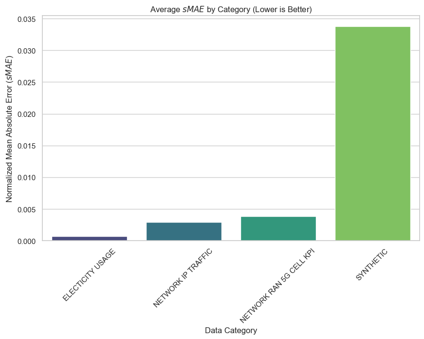
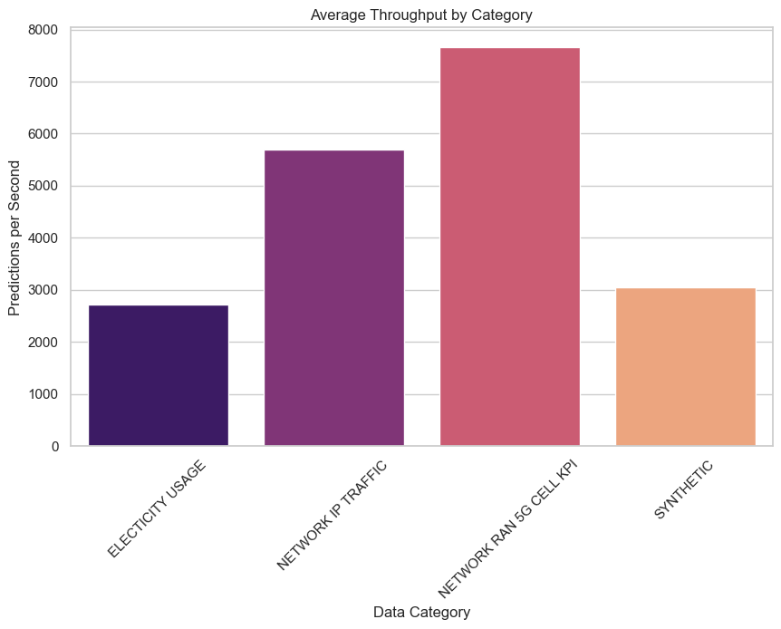
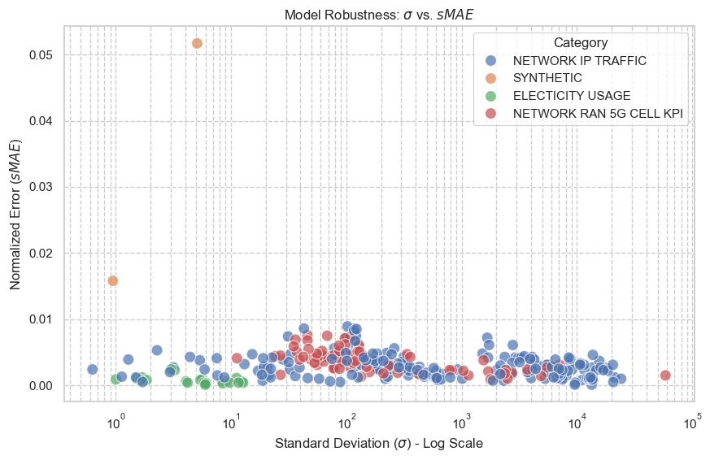
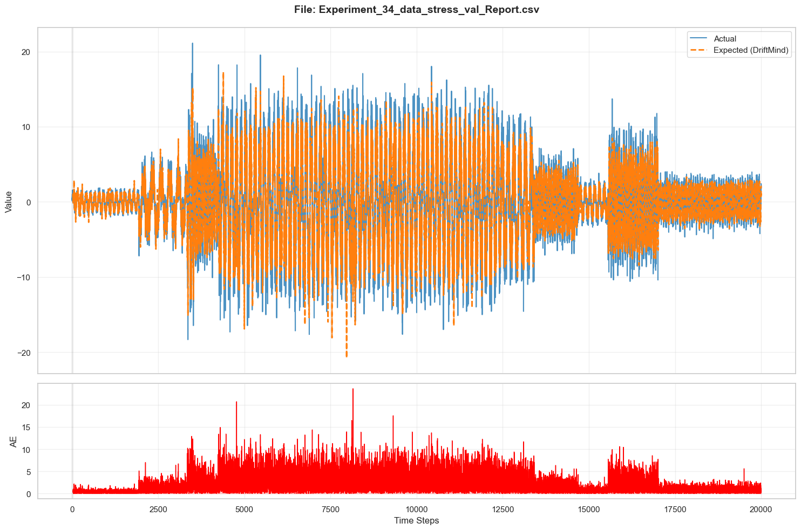
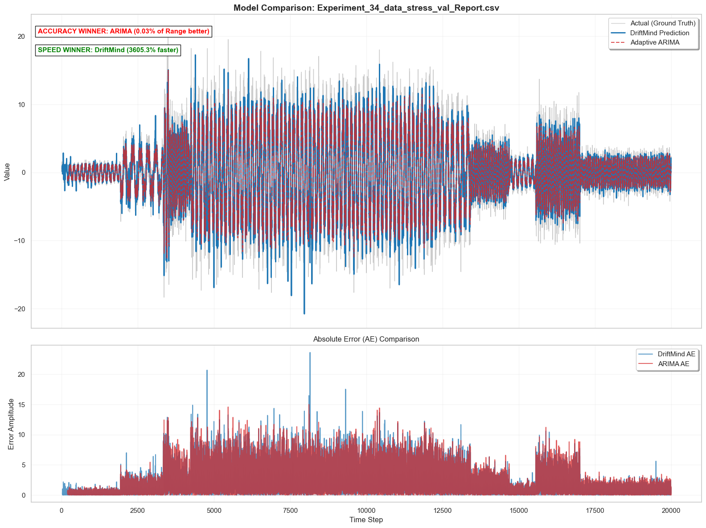

# DriftMind Benchmark Suite: Evaluation vs. Adaptive ARIMA
This notebook serves as a rigorous performance evaluation of DriftMind, an advanced system for real-time signal monitoring and forecasting, compared against a highly adaptive implementation of the Auto-Regressive Integrated Moving Average (ARIMA) model.

## What is DriftMind?
DriftMind is a specialized tool designed to solve the challenges of monitoring high-frequency, non-stationary signals. It functions as a forecasting and change-detection engine that addresses "Concept Drift"—the phenomenon where a signal's underlying statistical properties change over time.

### Key capabilities include:

- Real-time Adaptation: It continuously updates its internal parameters to match the current regime of a signal without requiring manual intervention.

- Multi-Domain Flexibility: It is engineered to handle signals across diverse sectors, including Network Telemetry (TCP/UDP), Industrial Sensors (IoT), and Financial time-series.

- Point-of-Change Detection: Beyond forecasting, it is capable of identifying the exact moment a signal drifts, making it vital for anomaly detection and predictive maintenance.

## Scientific Integrity & Latency Considerations
To ensure a mathematically sound and fair comparison, the following constraints apply:

On-Premises Latency Simulation: DriftMind core libraries are proprietary and currently accessible freely via a REST API. To avoid unfair latency comparisons between a cloud-hosted API and a local library (like ARIMA), the DriftMind results used here reflect on-premises execution speeds. These represent the performance of the paid, local binary version rather than a network-delayed API call.

Genuine Results: All DriftMind predictions provided in the dataset are genuine, verifiable, and generated by the core algorithm, despite being processed in a local offline environment for benchmarking purposes.

## Benchmarking Scope & Methodology
Current Focus: Each notebook in this suite compares DriftMind against one specific technology. This particular notebook evaluates performance against Adaptive ARIMA using a reactive retraining logic.

Data Dimensionality: At this stage, all datasets included are univariate. While Driftmind natively supports multivariate signals, benchmarks are currently under development.

Benchmark Angle: The ARIMA model used here is "Triggered," meaning it utilizes drift-detection metrics (MASE and Correlation) to simulate a competitor that is as "smart" and adaptable as DriftMind.

## An "Alive" Open-Source Benchmark
This suite is designed as a living project. We encourage community participation to increase the robustness of our evaluations:

- New Datasets: We are actively adding new datasets. If you have unique univariate or multivariate signals that challenge forecasting models, we welcome your contributions.

- New Baselines: We accept proposals for new benchmark models (e.g., Prophet, Transformer-based models, or custom DSP filters).

### Requirements for Inclusion: Any proposed baseline must be:

-  Cold-start ready: Capable of initializing with minimal or none historical data.

- Adaptable: Capable of handling non-stationary signals.

- Verifiable: Code and results must be fully transparent and reproducible.

## 1. Environment Setup and Dependency Loading

This section prepares the workspace for the benchmarking experiment. It handles system paths to ensure local modules are accessible and imports the necessary libraries for data manipulation, visualization, and time-series modeling.

#### Key Components:
* **Data Science Stack**: `pandas` and `numpy` for efficient data handling.
* **Visualization**: `matplotlib` and `seaborn` for generating high-fidelity performance charts.
* **Path Management**: Utilizing `pathlib` and `sys.path.insert` to allow the notebook to import custom baseline models from the project's `/src` directory.
* **Benchmark Target**: Imports the **`TriggeredARIMABaseline`**, which represents the **Reactive Angle**—an ARIMA model that adapts its parameters only when statistical drift is detected.


```python
import glob
import os
import sys
import time
from pathlib import Path

import matplotlib.pyplot as plt
import numpy as np
import pandas as pd
import seaborn as sns
from tqdm import tqdm

# --- Dynamic Path Configuration ---
# This ensures that the custom 'src' directory is in the Python path,
# allowing us to import baselines regardless of where the notebook is run.
sys.path.insert(0, str(Path.cwd().parent / "src"))

# --- Baseline Import ---
# Loading the 'Triggered' variant specifically for this experiment.
# This class separates state updates (fast) from parameter re-fitting (slow).
from arima.t_arima import TriggeredARIMABaseline
```

## 2. Exploratory Data Analysis (EDA) and Global Performance Metrics

This section loads the primary analysis log to provide a "bird's-eye view" of DriftMind's performance across all processed datasets. By aggregating results into categories, we can identify architectural strengths and weaknesses before diving into individual baseline comparisons.

#### Analytical Objectives:
1. **Metadata Loading**: Ingest the `analysis_results.csv` containing performance logs (MAE, sMAE, Throughput) for every experiment.
2. **Categorical Profiling**: Group data by 'Category' to calculate average precision ($sMAE$) and efficiency ($Throughput$).
3. **Statistical Visualization**: 
    * **Precision Check**: Bar charts comparing the normalized error across different data regimes.
    * **Efficiency Check**: Visualizing processing speed (TPS) to identify computational bottlenecks.
    * **Robustness Check**: A scatter plot analyzing the relationship between signal volatility ($\sigma$) and model error, identifying if higher variance leads to linear degradation in accuracy.


```python
# --- DATA INGESTION ---
# Load the master results file. Using 'pd.read_csv' allows us to verify
# the integrity of all previous DriftMind runs.
df = pd.read_csv("data\\driftmind_results\\analysis_results.csv")

# Configuration to ensure high-visibility when auditing the raw table in Jupyter
pd.set_option("display.max_rows", None)
pd.set_option("display.max_columns", None)
pd.set_option("display.width", 1000)

# Display raw experiment log
display(df)

# --- SECTION 1: Categorical Metrics Aggregation ---
# We group by 'Category' (e.g., Network, Sensor, Financial) to see
# how DriftMind generalizes across different domains.
summary = (
    df.groupby("Category")
    .agg(
        {
            "Dataset": "count",
            "sMAE": "mean",  # Accuracy metric (Normalized)
            "Throughput": "mean",  # Efficiency metric
            "Points": "sum",  # Volume handled
        }
    )
    .rename(
        columns={
            "Dataset": "File_Count",
            "sMAE": "Avg_sMAE",
            "Throughput": "Avg_TPS",
            "Points": "Total_Points",
        }
    )
    .sort_values("Avg_sMAE")
)

print("### Summary Metrics per Category ###")
display(summary)

# --- SECTION 2: Visualization Suite ---
sns.set_theme(style="whitegrid")

# Graph 1: Comparative Precision
# Lower sMAE indicates higher precision. This identifies 'easy' vs 'hard' categories.
plt.figure(figsize=(10, 6))
sns.barplot(
    x=summary.index,
    y="Avg_sMAE",
    data=summary,
    palette="viridis",
    hue=summary.index,
    legend=False,
)
plt.title("Average $sMAE$ by Category (Lower is Better)")
plt.ylabel("Normalized Mean Absolute Error ($sMAE$)")
plt.xlabel("Data Category")
plt.xticks(rotation=45)
plt.show()

# Graph 2: Comparative Efficiency
# High TPS is critical for real-time streaming applications.
plt.figure(figsize=(10, 6))
sns.barplot(
    x=summary.index,
    y="Avg_TPS",
    data=summary,
    palette="magma",
    hue=summary.index,
    legend=False,
)
plt.title("Average Throughput by Category")
plt.ylabel("Predictions per Second")
plt.xlabel("Data Category")
plt.xticks(rotation=45)
plt.show()

# Graph 3: Error Sensitivity (Volatility vs. Error)
# This scatter plot investigates if the model is sensitive to data noise.
# We use a Log Scale for StdDev to handle disparate data magnitudes.
plt.figure(figsize=(10, 6))
sns.scatterplot(x="StdDev", y="sMAE", hue="Category", data=df, s=100, alpha=0.7)
plt.xscale("log")
plt.title(r"Model Robustness: $\sigma$ vs. $sMAE$")
plt.xlabel(r"Standard Deviation ($\sigma$) - Log Scale")
plt.ylabel("Normalized Error ($sMAE$)")
plt.grid(True, which="both", ls="--")
plt.show()
```

    <>:61: SyntaxWarning: invalid escape sequence '\s'
    <>:62: SyntaxWarning: invalid escape sequence '\s'
    <>:61: SyntaxWarning: invalid escape sequence '\s'
    <>:62: SyntaxWarning: invalid escape sequence '\s'
    C:\Users\Roman\AppData\Local\Temp\ipykernel_58272\80192375.py:61: SyntaxWarning: invalid escape sequence '\s'
      plt.title('Model Robustness: $\sigma$ vs. $sMAE$')
    C:\Users\Roman\AppData\Local\Temp\ipykernel_58272\80192375.py:62: SyntaxWarning: invalid escape sequence '\s'
      plt.xlabel('Standard Deviation ($\sigma$) - Log Scale')
    


<div>
<style scoped>
    .dataframe tbody tr th:only-of-type {
        vertical-align: middle;
    }

    .dataframe tbody tr th {
        vertical-align: top;
    }

    .dataframe thead th {
        text-align: right;
    }
</style>
<table border="1" class="dataframe">
  <thead>
    <tr style="text-align: right;">
      <th></th>
      <th>Experiment Id</th>
      <th>Category</th>
      <th>Dataset</th>
      <th>Mean</th>
      <th>StdDev</th>
      <th>Min</th>
      <th>Max</th>
      <th>Range</th>
      <th>MAE</th>
      <th>sMAE</th>
      <th>Time</th>
      <th>Points</th>
      <th>Throughput</th>
    </tr>
  </thead>
  <tbody>
    <tr>
      <th>0</th>
      <td>0</td>
      <td>NETWORK IP TRAFFIC</td>
      <td>accessnetwork_TCP_TCP_frame_length.csv</td>
      <td>843.9509</td>
      <td>223.8227</td>
      <td>452.8859</td>
      <td>1491.3767</td>
      <td>1038.4908</td>
      <td>5.0635</td>
      <td>0.0049</td>
      <td>00:00:01</td>
      <td>1670</td>
      <td>1199.1247</td>
    </tr>
    <tr>
      <th>1</th>
      <td>1</td>
      <td>NETWORK IP TRAFFIC</td>
      <td>accessnetwork_TCP_TCP_tcp_window_size.csv</td>
      <td>29015.4389</td>
      <td>2902.2413</td>
      <td>22123.8458</td>
      <td>32839.7745</td>
      <td>10715.9287</td>
      <td>44.8297</td>
      <td>0.0042</td>
      <td>00:00:00</td>
      <td>1670</td>
      <td>4303.6649</td>
    </tr>
    <tr>
      <th>2</th>
      <td>2</td>
      <td>NETWORK IP TRAFFIC</td>
      <td>afs-kaserver_TCP_TCP_frame_length.csv</td>
      <td>783.6823</td>
      <td>319.4542</td>
      <td>221.1309</td>
      <td>1298.2731</td>
      <td>1077.1423</td>
      <td>4.2289</td>
      <td>0.0039</td>
      <td>00:00:00</td>
      <td>1868</td>
      <td>5060.4396</td>
    </tr>
    <tr>
      <th>3</th>
      <td>3</td>
      <td>NETWORK IP TRAFFIC</td>
      <td>afs-kaserver_TCP_TCP_tcp_window_size.csv</td>
      <td>60022.1327</td>
      <td>5380.3203</td>
      <td>31099.8011</td>
      <td>65486.5222</td>
      <td>34386.7210</td>
      <td>107.5649</td>
      <td>0.0031</td>
      <td>00:00:00</td>
      <td>1868</td>
      <td>4120.8054</td>
    </tr>
    <tr>
      <th>4</th>
      <td>4</td>
      <td>NETWORK IP TRAFFIC</td>
      <td>agcat_TCP_TCP_frame_length.csv</td>
      <td>556.3203</td>
      <td>590.0844</td>
      <td>68.0000</td>
      <td>1447.3138</td>
      <td>1379.3138</td>
      <td>2.2824</td>
      <td>0.0017</td>
      <td>00:00:00</td>
      <td>999</td>
      <td>9355.7692</td>
    </tr>
    <tr>
      <th>5</th>
      <td>5</td>
      <td>NETWORK IP TRAFFIC</td>
      <td>agcat_TCP_TCP_tcp_window_size.csv</td>
      <td>43764.9924</td>
      <td>13315.2350</td>
      <td>32127.2661</td>
      <td>64362.7394</td>
      <td>32235.4733</td>
      <td>50.0135</td>
      <td>0.0016</td>
      <td>00:00:00</td>
      <td>999</td>
      <td>11865.8537</td>
    </tr>
    <tr>
      <th>6</th>
      <td>6</td>
      <td>NETWORK IP TRAFFIC</td>
      <td>amt-esd-prot_TCP_TCP_frame_length.csv</td>
      <td>618.1122</td>
      <td>117.5931</td>
      <td>328.8377</td>
      <td>904.1157</td>
      <td>575.2780</td>
      <td>4.9333</td>
      <td>0.0086</td>
      <td>00:00:00</td>
      <td>1373</td>
      <td>5520.4918</td>
    </tr>
    <tr>
      <th>7</th>
      <td>7</td>
      <td>NETWORK IP TRAFFIC</td>
      <td>amt-esd-prot_TCP_TCP_tcp_window_size.csv</td>
      <td>27286.4536</td>
      <td>7042.6554</td>
      <td>11121.6397</td>
      <td>32768.0000</td>
      <td>21646.3603</td>
      <td>43.4694</td>
      <td>0.0020</td>
      <td>00:00:00</td>
      <td>1373</td>
      <td>10052.2388</td>
    </tr>
    <tr>
      <th>8</th>
      <td>8</td>
      <td>NETWORK IP TRAFFIC</td>
      <td>avast_TCP_TCP_frame_length.csv</td>
      <td>1390.3148</td>
      <td>211.1173</td>
      <td>656.1298</td>
      <td>1522.0000</td>
      <td>865.8702</td>
      <td>2.0636</td>
      <td>0.0024</td>
      <td>00:00:00</td>
      <td>1373</td>
      <td>6570.7317</td>
    </tr>
    <tr>
      <th>9</th>
      <td>9</td>
      <td>NETWORK IP TRAFFIC</td>
      <td>boinc-client_TCP_TCP_frame_length.csv</td>
      <td>627.8577</td>
      <td>116.0240</td>
      <td>336.0311</td>
      <td>988.3726</td>
      <td>652.3415</td>
      <td>4.0160</td>
      <td>0.0062</td>
      <td>00:00:00</td>
      <td>1729</td>
      <td>6238.0952</td>
    </tr>
    <tr>
      <th>10</th>
      <td>10</td>
      <td>NETWORK IP TRAFFIC</td>
      <td>boinc-client_TCP_TCP_tcp_window_size.csv</td>
      <td>26447.4256</td>
      <td>7119.9197</td>
      <td>11802.3186</td>
      <td>32768.0000</td>
      <td>20965.6814</td>
      <td>45.6274</td>
      <td>0.0022</td>
      <td>00:00:00</td>
      <td>1729</td>
      <td>9205.4054</td>
    </tr>
    <tr>
      <th>11</th>
      <td>11</td>
      <td>NETWORK IP TRAFFIC</td>
      <td>cadkey-tablet_TCP_TCP_frame_length.csv</td>
      <td>352.3476</td>
      <td>472.9710</td>
      <td>74.2383</td>
      <td>1521.9711</td>
      <td>1447.7329</td>
      <td>1.8374</td>
      <td>0.0013</td>
      <td>00:00:00</td>
      <td>2354</td>
      <td>7708.6093</td>
    </tr>
    <tr>
      <th>12</th>
      <td>12</td>
      <td>NETWORK IP TRAFFIC</td>
      <td>cadkey-tablet_TCP_TCP_ip_ttl.csv</td>
      <td>134.1292</td>
      <td>28.1884</td>
      <td>67.1091</td>
      <td>208.3339</td>
      <td>141.2247</td>
      <td>0.5559</td>
      <td>0.0039</td>
      <td>00:00:00</td>
      <td>2354</td>
      <td>10728.1106</td>
    </tr>
    <tr>
      <th>13</th>
      <td>13</td>
      <td>NETWORK IP TRAFFIC</td>
      <td>cadkey-tablet_TCP_TCP_tcp_window_size.csv</td>
      <td>48809.0949</td>
      <td>8561.8622</td>
      <td>35998.1065</td>
      <td>64623.6658</td>
      <td>28625.5593</td>
      <td>87.4989</td>
      <td>0.0031</td>
      <td>00:00:00</td>
      <td>2354</td>
      <td>5255.0790</td>
    </tr>
    <tr>
      <th>14</th>
      <td>14</td>
      <td>NETWORK IP TRAFFIC</td>
      <td>cassandra-thrift_TCP_TCP_frame_length.csv</td>
      <td>1407.8127</td>
      <td>118.7704</td>
      <td>891.2568</td>
      <td>1522.0000</td>
      <td>630.7432</td>
      <td>1.7851</td>
      <td>0.0028</td>
      <td>00:00:02</td>
      <td>10000</td>
      <td>4183.7248</td>
    </tr>
    <tr>
      <th>15</th>
      <td>15</td>
      <td>NETWORK IP TRAFFIC</td>
      <td>childkey-ctrl_TCP_TCP_frame_length.csv</td>
      <td>1071.0447</td>
      <td>405.7443</td>
      <td>68.0000</td>
      <td>1521.5086</td>
      <td>1453.5086</td>
      <td>3.4157</td>
      <td>0.0024</td>
      <td>00:00:00</td>
      <td>4335</td>
      <td>6402.6746</td>
    </tr>
    <tr>
      <th>16</th>
      <td>16</td>
      <td>NETWORK IP TRAFFIC</td>
      <td>childkey-ctrl_TCP_TCP_tcp_window_size.csv</td>
      <td>55223.3383</td>
      <td>9101.5324</td>
      <td>32243.7632</td>
      <td>64892.0655</td>
      <td>32648.3023</td>
      <td>77.6430</td>
      <td>0.0024</td>
      <td>00:00:00</td>
      <td>4335</td>
      <td>7145.9370</td>
    </tr>
    <tr>
      <th>17</th>
      <td>17</td>
      <td>NETWORK IP TRAFFIC</td>
      <td>cisco-sccp_TCP_TCP_frame_length.csv</td>
      <td>76.3462</td>
      <td>3.1759</td>
      <td>70.7046</td>
      <td>102.9682</td>
      <td>32.2636</td>
      <td>0.0868</td>
      <td>0.0027</td>
      <td>00:00:00</td>
      <td>2597</td>
      <td>8034.3750</td>
    </tr>
    <tr>
      <th>18</th>
      <td>18</td>
      <td>NETWORK IP TRAFFIC</td>
      <td>cisco-sccp_TCP_TCP_tcp_window_size.csv</td>
      <td>11004.3524</td>
      <td>1666.1030</td>
      <td>7457.1783</td>
      <td>14881.6482</td>
      <td>7424.4700</td>
      <td>53.2277</td>
      <td>0.0072</td>
      <td>00:00:00</td>
      <td>2597</td>
      <td>6225.1816</td>
    </tr>
    <tr>
      <th>19</th>
      <td>19</td>
      <td>NETWORK IP TRAFFIC</td>
      <td>cma_TCP_TCP_frame_length.csv</td>
      <td>633.0636</td>
      <td>116.0840</td>
      <td>219.2176</td>
      <td>962.2582</td>
      <td>743.0406</td>
      <td>4.8447</td>
      <td>0.0065</td>
      <td>00:00:00</td>
      <td>1591</td>
      <td>12620.9677</td>
    </tr>
    <tr>
      <th>20</th>
      <td>20</td>
      <td>NETWORK IP TRAFFIC</td>
      <td>codasrv_TCP_TCP_frame_length.csv</td>
      <td>1076.3959</td>
      <td>348.9104</td>
      <td>68.0000</td>
      <td>1487.1982</td>
      <td>1419.1982</td>
      <td>3.3834</td>
      <td>0.0024</td>
      <td>00:00:00</td>
      <td>5800</td>
      <td>7007.2816</td>
    </tr>
    <tr>
      <th>21</th>
      <td>21</td>
      <td>NETWORK IP TRAFFIC</td>
      <td>codasrv_TCP_TCP_tcp_window_size.csv</td>
      <td>55244.4989</td>
      <td>7805.4502</td>
      <td>31714.8033</td>
      <td>64248.1138</td>
      <td>32533.3105</td>
      <td>73.2051</td>
      <td>0.0023</td>
      <td>00:00:00</td>
      <td>5800</td>
      <td>6923.2614</td>
    </tr>
    <tr>
      <th>22</th>
      <td>22</td>
      <td>NETWORK IP TRAFFIC</td>
      <td>cogsys-lm_TCP_TCP_tcp_window_size.csv</td>
      <td>55885.8285</td>
      <td>13306.9517</td>
      <td>32360.2603</td>
      <td>64952.6179</td>
      <td>32592.3577</td>
      <td>23.9970</td>
      <td>0.0007</td>
      <td>00:00:00</td>
      <td>2280</td>
      <td>15229.7297</td>
    </tr>
    <tr>
      <th>23</th>
      <td>23</td>
      <td>NETWORK IP TRAFFIC</td>
      <td>commplex-link_TCP_TCP_frame_length.csv</td>
      <td>1184.7703</td>
      <td>150.9647</td>
      <td>722.1408</td>
      <td>1492.9431</td>
      <td>770.8023</td>
      <td>3.0067</td>
      <td>0.0039</td>
      <td>00:00:02</td>
      <td>10000</td>
      <td>4894.0137</td>
    </tr>
    <tr>
      <th>24</th>
      <td>24</td>
      <td>NETWORK IP TRAFFIC</td>
      <td>commplex-link_TCP_TCP_ip_ttl.csv</td>
      <td>96.1395</td>
      <td>7.5418</td>
      <td>74.2547</td>
      <td>117.6364</td>
      <td>43.3817</td>
      <td>0.1766</td>
      <td>0.0041</td>
      <td>00:00:01</td>
      <td>10000</td>
      <td>5489.2680</td>
    </tr>
    <tr>
      <th>25</th>
      <td>25</td>
      <td>NETWORK IP TRAFFIC</td>
      <td>commplex-link_TCP_TCP_tcp_window_size.csv</td>
      <td>5787.0083</td>
      <td>3088.6049</td>
      <td>419.0338</td>
      <td>15489.8217</td>
      <td>15070.7879</td>
      <td>61.9993</td>
      <td>0.0041</td>
      <td>00:00:01</td>
      <td>10000</td>
      <td>5867.0588</td>
    </tr>
    <tr>
      <th>26</th>
      <td>26</td>
      <td>NETWORK IP TRAFFIC</td>
      <td>con_TCP_TCP_frame_length.csv</td>
      <td>1299.1643</td>
      <td>169.5310</td>
      <td>539.9920</td>
      <td>1511.8111</td>
      <td>971.8191</td>
      <td>3.5953</td>
      <td>0.0037</td>
      <td>00:00:00</td>
      <td>1811</td>
      <td>15127.1186</td>
    </tr>
    <tr>
      <th>27</th>
      <td>27</td>
      <td>NETWORK IP TRAFFIC</td>
      <td>con_TCP_TCP_tcp_window_size.csv</td>
      <td>25531.8749</td>
      <td>6306.1563</td>
      <td>14943.2271</td>
      <td>32849.2053</td>
      <td>17905.9783</td>
      <td>38.3014</td>
      <td>0.0021</td>
      <td>00:00:00</td>
      <td>1811</td>
      <td>11590.9091</td>
    </tr>
    <tr>
      <th>28</th>
      <td>28</td>
      <td>NETWORK IP TRAFFIC</td>
      <td>corba-iiop-ssl_TCP_TCP_frame_length.csv</td>
      <td>430.5930</td>
      <td>185.5603</td>
      <td>118.5609</td>
      <td>905.2912</td>
      <td>786.7304</td>
      <td>2.5559</td>
      <td>0.0032</td>
      <td>00:00:00</td>
      <td>1085</td>
      <td>10806.1224</td>
    </tr>
    <tr>
      <th>29</th>
      <td>29</td>
      <td>NETWORK IP TRAFFIC</td>
      <td>corba-iiop-ssl_TCP_TCP_tcp_window_size.csv</td>
      <td>23552.8337</td>
      <td>8748.3664</td>
      <td>9987.2504</td>
      <td>41435.8247</td>
      <td>31448.5743</td>
      <td>125.8566</td>
      <td>0.0040</td>
      <td>00:00:00</td>
      <td>1085</td>
      <td>9540.5405</td>
    </tr>
    <tr>
      <th>30</th>
      <td>30</td>
      <td>NETWORK IP TRAFFIC</td>
      <td>cosmocall_TCP_TCP_tcp_window_size.csv</td>
      <td>54829.4857</td>
      <td>13790.5856</td>
      <td>32768.0000</td>
      <td>64896.4266</td>
      <td>32128.4266</td>
      <td>26.1465</td>
      <td>0.0008</td>
      <td>00:00:00</td>
      <td>2295</td>
      <td>8498.1273</td>
    </tr>
    <tr>
      <th>31</th>
      <td>31</td>
      <td>NETWORK IP TRAFFIC</td>
      <td>cvd_TCP_TCP_frame_length.csv</td>
      <td>1421.7892</td>
      <td>217.8559</td>
      <td>443.9994</td>
      <td>1522.0000</td>
      <td>1078.0006</td>
      <td>1.0702</td>
      <td>0.0010</td>
      <td>00:00:01</td>
      <td>7628</td>
      <td>5074.7664</td>
    </tr>
    <tr>
      <th>32</th>
      <td>32</td>
      <td>NETWORK IP TRAFFIC</td>
      <td>cycleserv_TCP_TCP_frame_length.csv</td>
      <td>637.0043</td>
      <td>580.1713</td>
      <td>84.0414</td>
      <td>1486.6292</td>
      <td>1402.5879</td>
      <td>1.6304</td>
      <td>0.0012</td>
      <td>00:00:00</td>
      <td>5457</td>
      <td>6754.9751</td>
    </tr>
    <tr>
      <th>33</th>
      <td>33</td>
      <td>NETWORK IP TRAFFIC</td>
      <td>cycleserv_TCP_TCP_tcp_window_size.csv</td>
      <td>20582.4651</td>
      <td>13423.1233</td>
      <td>3081.9844</td>
      <td>32715.8415</td>
      <td>29633.8572</td>
      <td>2.3397</td>
      <td>0.0001</td>
      <td>00:00:00</td>
      <td>5457</td>
      <td>7522.1607</td>
    </tr>
    <tr>
      <th>34</th>
      <td>34</td>
      <td>SYNTHETIC</td>
      <td>data_stress_val.csv</td>
      <td>-0.0314</td>
      <td>5.0971</td>
      <td>-18.3397</td>
      <td>21.1245</td>
      <td>39.4642</td>
      <td>2.0392</td>
      <td>0.0517</td>
      <td>00:00:04</td>
      <td>20000</td>
      <td>4929.4176</td>
    </tr>
    <tr>
      <th>35</th>
      <td>35</td>
      <td>NETWORK IP TRAFFIC</td>
      <td>dcutility_TCP_TCP_frame_length.csv</td>
      <td>633.6085</td>
      <td>119.2780</td>
      <td>303.7433</td>
      <td>931.8687</td>
      <td>628.1254</td>
      <td>4.9412</td>
      <td>0.0079</td>
      <td>00:00:00</td>
      <td>1421</td>
      <td>8353.2934</td>
    </tr>
    <tr>
      <th>36</th>
      <td>36</td>
      <td>NETWORK IP TRAFFIC</td>
      <td>dcutility_TCP_TCP_tcp_window_size.csv</td>
      <td>26627.9869</td>
      <td>7324.9438</td>
      <td>7834.7093</td>
      <td>32768.0000</td>
      <td>24933.2907</td>
      <td>51.5277</td>
      <td>0.0021</td>
      <td>00:00:00</td>
      <td>1421</td>
      <td>12345.1327</td>
    </tr>
    <tr>
      <th>37</th>
      <td>37</td>
      <td>NETWORK IP TRAFFIC</td>
      <td>dnp_TCP_TCP_frame_length.csv</td>
      <td>446.0559</td>
      <td>124.1364</td>
      <td>96.4020</td>
      <td>831.5398</td>
      <td>735.1378</td>
      <td>2.8483</td>
      <td>0.0039</td>
      <td>00:00:02</td>
      <td>10000</td>
      <td>3911.3725</td>
    </tr>
    <tr>
      <th>38</th>
      <td>38</td>
      <td>NETWORK IP TRAFFIC</td>
      <td>dnp_TCP_TCP_ip_ttl.csv</td>
      <td>149.8091</td>
      <td>32.3088</td>
      <td>64.0000</td>
      <td>246.1705</td>
      <td>182.1705</td>
      <td>0.4458</td>
      <td>0.0024</td>
      <td>00:00:02</td>
      <td>10000</td>
      <td>4109.6003</td>
    </tr>
    <tr>
      <th>39</th>
      <td>39</td>
      <td>NETWORK IP TRAFFIC</td>
      <td>dnp_TCP_TCP_tcp_window_size.csv</td>
      <td>40803.1333</td>
      <td>13667.0760</td>
      <td>124.3618</td>
      <td>65206.8187</td>
      <td>65082.4569</td>
      <td>176.0492</td>
      <td>0.0027</td>
      <td>00:00:02</td>
      <td>10000</td>
      <td>4338.4080</td>
    </tr>
    <tr>
      <th>40</th>
      <td>40</td>
      <td>NETWORK IP TRAFFIC</td>
      <td>elasticsearch_TCP_TCP_frame_length.csv</td>
      <td>1146.6894</td>
      <td>329.9921</td>
      <td>211.9932</td>
      <td>1514.7609</td>
      <td>1302.7677</td>
      <td>3.8030</td>
      <td>0.0029</td>
      <td>00:00:00</td>
      <td>2480</td>
      <td>8125.8278</td>
    </tr>
    <tr>
      <th>41</th>
      <td>41</td>
      <td>NETWORK IP TRAFFIC</td>
      <td>etlservicemgr_TCP_TCP_frame_length.csv</td>
      <td>1291.5135</td>
      <td>345.6633</td>
      <td>188.4090</td>
      <td>1522.0000</td>
      <td>1333.5910</td>
      <td>1.9659</td>
      <td>0.0015</td>
      <td>00:00:01</td>
      <td>6714</td>
      <td>4983.6066</td>
    </tr>
    <tr>
      <th>42</th>
      <td>42</td>
      <td>ELECTICITY USAGE</td>
      <td>ETTh1_HUFL.csv</td>
      <td>7.3756</td>
      <td>3.2464</td>
      <td>-4.4909</td>
      <td>20.4027</td>
      <td>24.8935</td>
      <td>0.0573</td>
      <td>0.0023</td>
      <td>00:00:07</td>
      <td>17420</td>
      <td>2349.5880</td>
    </tr>
    <tr>
      <th>43</th>
      <td>43</td>
      <td>ELECTICITY USAGE</td>
      <td>ETTh1_HULL.csv</td>
      <td>2.2424</td>
      <td>1.6957</td>
      <td>-3.2242</td>
      <td>7.2341</td>
      <td>10.4583</td>
      <td>0.0125</td>
      <td>0.0012</td>
      <td>00:00:06</td>
      <td>17420</td>
      <td>2488.7681</td>
    </tr>
    <tr>
      <th>44</th>
      <td>44</td>
      <td>ELECTICITY USAGE</td>
      <td>ETTh1_MUFL.csv</td>
      <td>4.3007</td>
      <td>3.0253</td>
      <td>-7.9518</td>
      <td>15.5652</td>
      <td>23.5170</td>
      <td>0.0553</td>
      <td>0.0024</td>
      <td>00:00:05</td>
      <td>17420</td>
      <td>2966.2347</td>
    </tr>
    <tr>
      <th>45</th>
      <td>45</td>
      <td>ELECTICITY USAGE</td>
      <td>ETTh1_MULL.csv</td>
      <td>0.8817</td>
      <td>1.5229</td>
      <td>-4.8668</td>
      <td>4.7835</td>
      <td>9.6503</td>
      <td>0.0099</td>
      <td>0.0010</td>
      <td>00:00:06</td>
      <td>17420</td>
      <td>2776.8199</td>
    </tr>
    <tr>
      <th>46</th>
      <td>46</td>
      <td>ELECTICITY USAGE</td>
      <td>ETTh1_OT.csv</td>
      <td>13.3242</td>
      <td>8.3775</td>
      <td>-2.1528</td>
      <td>41.4564</td>
      <td>43.6093</td>
      <td>0.0246</td>
      <td>0.0006</td>
      <td>00:00:05</td>
      <td>17420</td>
      <td>3322.6361</td>
    </tr>
    <tr>
      <th>47</th>
      <td>47</td>
      <td>ELECTICITY USAGE</td>
      <td>ETTh2_HUFL.csv</td>
      <td>37.1930</td>
      <td>9.1067</td>
      <td>6.1344</td>
      <td>97.1596</td>
      <td>91.0253</td>
      <td>0.0527</td>
      <td>0.0006</td>
      <td>00:00:05</td>
      <td>17420</td>
      <td>3200.9569</td>
    </tr>
    <tr>
      <th>48</th>
      <td>48</td>
      <td>ELECTICITY USAGE</td>
      <td>ETTh2_HULL.csv</td>
      <td>8.5375</td>
      <td>5.6677</td>
      <td>-6.2616</td>
      <td>28.6334</td>
      <td>34.8951</td>
      <td>0.0225</td>
      <td>0.0006</td>
      <td>00:00:06</td>
      <td>17420</td>
      <td>2870.2970</td>
    </tr>
    <tr>
      <th>49</th>
      <td>49</td>
      <td>ELECTICITY USAGE</td>
      <td>ETTh2_LUFL.csv</td>
      <td>-3.4236</td>
      <td>6.0242</td>
      <td>-12.2838</td>
      <td>12.5131</td>
      <td>24.7970</td>
      <td>0.0120</td>
      <td>0.0005</td>
      <td>00:00:08</td>
      <td>17420</td>
      <td>1955.4806</td>
    </tr>
    <tr>
      <th>50</th>
      <td>50</td>
      <td>ELECTICITY USAGE</td>
      <td>ETTh2_LULL.csv</td>
      <td>-2.0860</td>
      <td>5.9387</td>
      <td>-31.4620</td>
      <td>2.3911</td>
      <td>33.8531</td>
      <td>0.0058</td>
      <td>0.0002</td>
      <td>00:00:04</td>
      <td>17420</td>
      <td>4194.3574</td>
    </tr>
    <tr>
      <th>51</th>
      <td>51</td>
      <td>ELECTICITY USAGE</td>
      <td>ETTh2_MUFL.csv</td>
      <td>43.8300</td>
      <td>12.3967</td>
      <td>15.1310</td>
      <td>88.2980</td>
      <td>73.1670</td>
      <td>0.0460</td>
      <td>0.0006</td>
      <td>00:00:05</td>
      <td>17420</td>
      <td>2903.8397</td>
    </tr>
    <tr>
      <th>52</th>
      <td>52</td>
      <td>ELECTICITY USAGE</td>
      <td>ETTh2_MULL.csv</td>
      <td>8.3227</td>
      <td>4.0876</td>
      <td>-4.5180</td>
      <td>23.8723</td>
      <td>28.3904</td>
      <td>0.0172</td>
      <td>0.0006</td>
      <td>00:00:05</td>
      <td>17420</td>
      <td>3005.7024</td>
    </tr>
    <tr>
      <th>53</th>
      <td>53</td>
      <td>ELECTICITY USAGE</td>
      <td>ETTh2_OT.csv</td>
      <td>26.6085</td>
      <td>11.1784</td>
      <td>2.5042</td>
      <td>49.9649</td>
      <td>47.4606</td>
      <td>0.0500</td>
      <td>0.0011</td>
      <td>00:00:06</td>
      <td>17420</td>
      <td>2673.1213</td>
    </tr>
    <tr>
      <th>54</th>
      <td>54</td>
      <td>ELECTICITY USAGE</td>
      <td>ETTm1_HUFL.csv</td>
      <td>7.4138</td>
      <td>5.6411</td>
      <td>-17.9388</td>
      <td>21.3670</td>
      <td>39.3058</td>
      <td>0.0342</td>
      <td>0.0009</td>
      <td>00:00:25</td>
      <td>69680</td>
      <td>2742.8234</td>
    </tr>
    <tr>
      <th>55</th>
      <td>55</td>
      <td>ELECTICITY USAGE</td>
      <td>ETTm1_HULL.csv</td>
      <td>2.2614</td>
      <td>1.8585</td>
      <td>-4.2847</td>
      <td>9.0679</td>
      <td>13.3526</td>
      <td>0.0106</td>
      <td>0.0008</td>
      <td>00:00:30</td>
      <td>69680</td>
      <td>2290.5719</td>
    </tr>
    <tr>
      <th>56</th>
      <td>56</td>
      <td>ELECTICITY USAGE</td>
      <td>ETTm1_LUFL.csv</td>
      <td>3.0829</td>
      <td>1.0060</td>
      <td>0.0000</td>
      <td>8.2850</td>
      <td>8.2850</td>
      <td>0.0078</td>
      <td>0.0009</td>
      <td>00:00:26</td>
      <td>69680</td>
      <td>2626.0745</td>
    </tr>
    <tr>
      <th>57</th>
      <td>57</td>
      <td>ELECTICITY USAGE</td>
      <td>ETTm1_MUFL.csv</td>
      <td>4.3220</td>
      <td>5.4354</td>
      <td>-20.7296</td>
      <td>16.3460</td>
      <td>37.0756</td>
      <td>0.0294</td>
      <td>0.0008</td>
      <td>00:00:22</td>
      <td>69680</td>
      <td>3157.6227</td>
    </tr>
    <tr>
      <th>58</th>
      <td>58</td>
      <td>ELECTICITY USAGE</td>
      <td>ETTm1_MULL.csv</td>
      <td>0.8965</td>
      <td>1.6497</td>
      <td>-5.5469</td>
      <td>6.4309</td>
      <td>11.9778</td>
      <td>0.0091</td>
      <td>0.0008</td>
      <td>00:00:30</td>
      <td>69680</td>
      <td>2251.4060</td>
    </tr>
    <tr>
      <th>59</th>
      <td>59</td>
      <td>ELECTICITY USAGE</td>
      <td>ETTm1_OT.csv</td>
      <td>13.3206</td>
      <td>8.4960</td>
      <td>-3.5756</td>
      <td>44.0498</td>
      <td>47.6254</td>
      <td>0.0140</td>
      <td>0.0003</td>
      <td>00:00:24</td>
      <td>69680</td>
      <td>2870.1994</td>
    </tr>
    <tr>
      <th>60</th>
      <td>60</td>
      <td>ELECTICITY USAGE</td>
      <td>ETTm2_HUFL.csv</td>
      <td>37.2194</td>
      <td>9.7392</td>
      <td>0.0000</td>
      <td>102.2248</td>
      <td>102.2248</td>
      <td>0.0362</td>
      <td>0.0004</td>
      <td>00:00:39</td>
      <td>69680</td>
      <td>1773.1786</td>
    </tr>
    <tr>
      <th>61</th>
      <td>61</td>
      <td>ELECTICITY USAGE</td>
      <td>ETTm2_HULL.csv</td>
      <td>8.5542</td>
      <td>5.8414</td>
      <td>-9.3672</td>
      <td>32.0228</td>
      <td>41.3900</td>
      <td>0.0156</td>
      <td>0.0004</td>
      <td>00:00:28</td>
      <td>69680</td>
      <td>2478.0845</td>
    </tr>
    <tr>
      <th>62</th>
      <td>62</td>
      <td>ELECTICITY USAGE</td>
      <td>ETTm2_LUFL.csv</td>
      <td>-3.4307</td>
      <td>6.0853</td>
      <td>-13.1787</td>
      <td>15.2021</td>
      <td>28.3808</td>
      <td>0.0093</td>
      <td>0.0003</td>
      <td>00:00:35</td>
      <td>69680</td>
      <td>1944.3390</td>
    </tr>
    <tr>
      <th>63</th>
      <td>63</td>
      <td>ELECTICITY USAGE</td>
      <td>ETTm2_LULL.csv</td>
      <td>-2.0849</td>
      <td>5.9846</td>
      <td>-31.4620</td>
      <td>2.6140</td>
      <td>34.0760</td>
      <td>0.0045</td>
      <td>0.0001</td>
      <td>00:00:30</td>
      <td>69680</td>
      <td>2296.3109</td>
    </tr>
    <tr>
      <th>64</th>
      <td>64</td>
      <td>ELECTICITY USAGE</td>
      <td>ETTm2_MUFL.csv</td>
      <td>43.8614</td>
      <td>12.7510</td>
      <td>12.0393</td>
      <td>88.2987</td>
      <td>76.2594</td>
      <td>0.0321</td>
      <td>0.0004</td>
      <td>00:00:19</td>
      <td>69680</td>
      <td>3505.8385</td>
    </tr>
    <tr>
      <th>65</th>
      <td>65</td>
      <td>ELECTICITY USAGE</td>
      <td>ETTm2_MULL.csv</td>
      <td>8.3402</td>
      <td>4.2119</td>
      <td>-6.1253</td>
      <td>26.2666</td>
      <td>32.3920</td>
      <td>0.0129</td>
      <td>0.0004</td>
      <td>00:00:38</td>
      <td>69680</td>
      <td>1815.6557</td>
    </tr>
    <tr>
      <th>66</th>
      <td>66</td>
      <td>ELECTICITY USAGE</td>
      <td>ETTm2_OT.csv</td>
      <td>26.6097</td>
      <td>11.6358</td>
      <td>-1.1296</td>
      <td>55.4584</td>
      <td>56.5879</td>
      <td>0.0225</td>
      <td>0.0004</td>
      <td>00:00:18</td>
      <td>69680</td>
      <td>3700.4728</td>
    </tr>
    <tr>
      <th>67</th>
      <td>67</td>
      <td>NETWORK IP TRAFFIC</td>
      <td>exp_TCP_TCP_frame_length.csv</td>
      <td>1022.9616</td>
      <td>128.9519</td>
      <td>595.0595</td>
      <td>1342.3666</td>
      <td>747.3072</td>
      <td>4.3311</td>
      <td>0.0058</td>
      <td>00:00:00</td>
      <td>1297</td>
      <td>8361.8421</td>
    </tr>
    <tr>
      <th>68</th>
      <td>68</td>
      <td>NETWORK IP TRAFFIC</td>
      <td>exp_TCP_TCP_tcp_window_size.csv</td>
      <td>14040.0604</td>
      <td>1516.6443</td>
      <td>6966.8017</td>
      <td>17857.5532</td>
      <td>10890.7515</td>
      <td>51.8728</td>
      <td>0.0048</td>
      <td>00:00:00</td>
      <td>1297</td>
      <td>13815.2174</td>
    </tr>
    <tr>
      <th>69</th>
      <td>69</td>
      <td>NETWORK IP TRAFFIC</td>
      <td>fcp-udp_TCP_TCP_frame_length.csv</td>
      <td>1269.8632</td>
      <td>150.0600</td>
      <td>668.0992</td>
      <td>1514.6226</td>
      <td>846.5234</td>
      <td>3.5342</td>
      <td>0.0042</td>
      <td>00:00:00</td>
      <td>3392</td>
      <td>4277.0013</td>
    </tr>
    <tr>
      <th>70</th>
      <td>70</td>
      <td>NETWORK IP TRAFFIC</td>
      <td>fcp-udp_TCP_TCP_tcp_window_size.csv</td>
      <td>21636.0806</td>
      <td>4730.4385</td>
      <td>15404.5536</td>
      <td>31321.2775</td>
      <td>15916.7239</td>
      <td>45.7783</td>
      <td>0.0029</td>
      <td>00:00:00</td>
      <td>3392</td>
      <td>8091.3462</td>
    </tr>
    <tr>
      <th>71</th>
      <td>71</td>
      <td>NETWORK IP TRAFFIC</td>
      <td>ftp-data_TCP_TCP_frame_length.csv</td>
      <td>1222.5227</td>
      <td>337.7931</td>
      <td>289.5479</td>
      <td>1522.0000</td>
      <td>1232.4521</td>
      <td>3.7050</td>
      <td>0.0030</td>
      <td>00:00:00</td>
      <td>3150</td>
      <td>10662.1160</td>
    </tr>
    <tr>
      <th>72</th>
      <td>72</td>
      <td>NETWORK IP TRAFFIC</td>
      <td>ftp-data_TCP_TCP_ip_ttl.csv</td>
      <td>69.9221</td>
      <td>18.8599</td>
      <td>56.4386</td>
      <td>128.0000</td>
      <td>71.5614</td>
      <td>0.0506</td>
      <td>0.0007</td>
      <td>00:00:00</td>
      <td>3150</td>
      <td>12751.0204</td>
    </tr>
    <tr>
      <th>73</th>
      <td>73</td>
      <td>NETWORK IP TRAFFIC</td>
      <td>ftp-data_TCP_TCP_tcp_window_size.csv</td>
      <td>11934.0317</td>
      <td>21208.5319</td>
      <td>15.0003</td>
      <td>64436.0000</td>
      <td>64420.9997</td>
      <td>79.8035</td>
      <td>0.0012</td>
      <td>00:00:00</td>
      <td>3150</td>
      <td>6703.8627</td>
    </tr>
    <tr>
      <th>74</th>
      <td>74</td>
      <td>NETWORK IP TRAFFIC</td>
      <td>ftp_TCP_TCP_frame_length.csv</td>
      <td>166.2210</td>
      <td>32.8063</td>
      <td>82.4184</td>
      <td>282.4324</td>
      <td>200.0140</td>
      <td>0.9383</td>
      <td>0.0047</td>
      <td>00:00:02</td>
      <td>10000</td>
      <td>3377.5821</td>
    </tr>
    <tr>
      <th>75</th>
      <td>75</td>
      <td>NETWORK IP TRAFFIC</td>
      <td>ftp_TCP_TCP_tcp_window_size.csv</td>
      <td>16879.7734</td>
      <td>2707.4039</td>
      <td>1487.5300</td>
      <td>21532.6734</td>
      <td>20045.1434</td>
      <td>43.0548</td>
      <td>0.0021</td>
      <td>00:00:02</td>
      <td>10000</td>
      <td>4081.0147</td>
    </tr>
    <tr>
      <th>76</th>
      <td>76</td>
      <td>NETWORK IP TRAFFIC</td>
      <td>ftranhc_TCP_TCP_frame_length.csv</td>
      <td>610.5096</td>
      <td>110.0082</td>
      <td>118.8930</td>
      <td>982.1374</td>
      <td>863.2444</td>
      <td>3.4966</td>
      <td>0.0041</td>
      <td>00:00:02</td>
      <td>9993</td>
      <td>4054.9227</td>
    </tr>
    <tr>
      <th>77</th>
      <td>77</td>
      <td>NETWORK IP TRAFFIC</td>
      <td>ftranhc_TCP_TCP_tcp_window_size.csv</td>
      <td>26413.0192</td>
      <td>7714.4709</td>
      <td>7125.7573</td>
      <td>32768.0000</td>
      <td>25642.2427</td>
      <td>31.8331</td>
      <td>0.0012</td>
      <td>00:00:00</td>
      <td>9993</td>
      <td>11173.7668</td>
    </tr>
    <tr>
      <th>78</th>
      <td>78</td>
      <td>NETWORK IP TRAFFIC</td>
      <td>gammafetchsvr_TCP_TCP_tcp_window_size.csv</td>
      <td>56365.1987</td>
      <td>12480.8688</td>
      <td>32651.5029</td>
      <td>64972.1653</td>
      <td>32320.6623</td>
      <td>36.4575</td>
      <td>0.0011</td>
      <td>00:00:00</td>
      <td>2415</td>
      <td>5674.5843</td>
    </tr>
    <tr>
      <th>79</th>
      <td>79</td>
      <td>NETWORK IP TRAFFIC</td>
      <td>gemini-lm_TCP_TCP_frame_length.csv</td>
      <td>603.5803</td>
      <td>299.7456</td>
      <td>141.4527</td>
      <td>1437.2454</td>
      <td>1295.7928</td>
      <td>3.0294</td>
      <td>0.0023</td>
      <td>00:00:02</td>
      <td>10000</td>
      <td>3773.7420</td>
    </tr>
    <tr>
      <th>80</th>
      <td>80</td>
      <td>NETWORK IP TRAFFIC</td>
      <td>gemini-lm_TCP_TCP_ip_ttl.csv</td>
      <td>59.4757</td>
      <td>0.6304</td>
      <td>57.3830</td>
      <td>61.9764</td>
      <td>4.5934</td>
      <td>0.0111</td>
      <td>0.0024</td>
      <td>00:00:02</td>
      <td>10000</td>
      <td>4271.5203</td>
    </tr>
    <tr>
      <th>81</th>
      <td>81</td>
      <td>NETWORK IP TRAFFIC</td>
      <td>gemini-lm_TCP_TCP_tcp_window_size.csv</td>
      <td>30405.1957</td>
      <td>11511.7191</td>
      <td>5572.4191</td>
      <td>59962.1724</td>
      <td>54389.7533</td>
      <td>132.7451</td>
      <td>0.0024</td>
      <td>00:00:03</td>
      <td>10000</td>
      <td>3030.6898</td>
    </tr>
    <tr>
      <th>82</th>
      <td>82</td>
      <td>NETWORK IP TRAFFIC</td>
      <td>glrpc_TCP_TCP_frame_length.csv</td>
      <td>1190.0807</td>
      <td>314.6504</td>
      <td>454.9165</td>
      <td>1503.6800</td>
      <td>1048.7635</td>
      <td>4.4900</td>
      <td>0.0043</td>
      <td>00:00:00</td>
      <td>922</td>
      <td>5463.4146</td>
    </tr>
    <tr>
      <th>83</th>
      <td>83</td>
      <td>NETWORK IP TRAFFIC</td>
      <td>glrpc_TCP_TCP_tcp_window_size.csv</td>
      <td>4504.9565</td>
      <td>2777.0315</td>
      <td>647.9306</td>
      <td>14640.3441</td>
      <td>13992.4135</td>
      <td>85.1552</td>
      <td>0.0061</td>
      <td>00:00:00</td>
      <td>922</td>
      <td>9431.5789</td>
    </tr>
    <tr>
      <th>84</th>
      <td>84</td>
      <td>NETWORK IP TRAFFIC</td>
      <td>gtp-control_TCP_TCP_frame_length.csv</td>
      <td>1010.8710</td>
      <td>477.9159</td>
      <td>68.0000</td>
      <td>1522.0000</td>
      <td>1454.0000</td>
      <td>2.3442</td>
      <td>0.0016</td>
      <td>00:00:03</td>
      <td>10000</td>
      <td>2653.3653</td>
    </tr>
    <tr>
      <th>85</th>
      <td>85</td>
      <td>NETWORK IP TRAFFIC</td>
      <td>gtp-control_TCP_TCP_tcp_window_size.csv</td>
      <td>64207.9278</td>
      <td>675.7828</td>
      <td>63318.9216</td>
      <td>65535.0000</td>
      <td>2216.0784</td>
      <td>3.7831</td>
      <td>0.0017</td>
      <td>00:00:04</td>
      <td>10000</td>
      <td>2417.9394</td>
    </tr>
    <tr>
      <th>86</th>
      <td>86</td>
      <td>NETWORK IP TRAFFIC</td>
      <td>hive-server_TCP_TCP_frame_length.csv</td>
      <td>337.3219</td>
      <td>309.2767</td>
      <td>75.2855</td>
      <td>1127.5019</td>
      <td>1052.2165</td>
      <td>3.3714</td>
      <td>0.0032</td>
      <td>00:00:00</td>
      <td>924</td>
      <td>5831.1688</td>
    </tr>
    <tr>
      <th>87</th>
      <td>87</td>
      <td>NETWORK IP TRAFFIC</td>
      <td>hive-server_TCP_TCP_tcp_window_size.csv</td>
      <td>3039.1840</td>
      <td>2739.2358</td>
      <td>201.1659</td>
      <td>12998.6125</td>
      <td>12797.4466</td>
      <td>21.6955</td>
      <td>0.0017</td>
      <td>00:00:00</td>
      <td>924</td>
      <td>5947.0199</td>
    </tr>
    <tr>
      <th>88</th>
      <td>88</td>
      <td>NETWORK IP TRAFFIC</td>
      <td>hive-webui_TCP_TCP_frame_length.csv</td>
      <td>975.8199</td>
      <td>308.8211</td>
      <td>93.7337</td>
      <td>1511.4037</td>
      <td>1417.6700</td>
      <td>5.1718</td>
      <td>0.0036</td>
      <td>00:00:00</td>
      <td>1708</td>
      <td>4072.6392</td>
    </tr>
    <tr>
      <th>89</th>
      <td>89</td>
      <td>NETWORK IP TRAFFIC</td>
      <td>hive-webui_TCP_TCP_tcp_window_size.csv</td>
      <td>32387.9478</td>
      <td>11512.8687</td>
      <td>13823.6103</td>
      <td>63917.6033</td>
      <td>50093.9930</td>
      <td>156.8239</td>
      <td>0.0031</td>
      <td>00:00:00</td>
      <td>1708</td>
      <td>3432.6531</td>
    </tr>
    <tr>
      <th>90</th>
      <td>90</td>
      <td>NETWORK IP TRAFFIC</td>
      <td>hri-port_TCP_TCP_frame_length.csv</td>
      <td>1090.0804</td>
      <td>184.2038</td>
      <td>737.7176</td>
      <td>1522.0000</td>
      <td>784.2824</td>
      <td>3.7550</td>
      <td>0.0048</td>
      <td>00:00:00</td>
      <td>1523</td>
      <td>3992.0000</td>
    </tr>
    <tr>
      <th>91</th>
      <td>91</td>
      <td>NETWORK IP TRAFFIC</td>
      <td>hri-port_TCP_TCP_tcp_window_size.csv</td>
      <td>64084.7377</td>
      <td>260.4869</td>
      <td>63462.0285</td>
      <td>64617.7300</td>
      <td>1155.7015</td>
      <td>6.5192</td>
      <td>0.0056</td>
      <td>00:00:00</td>
      <td>1523</td>
      <td>3633.4951</td>
    </tr>
    <tr>
      <th>92</th>
      <td>92</td>
      <td>NETWORK IP TRAFFIC</td>
      <td>http-alt_TCP_TCP_frame_length.csv</td>
      <td>994.8290</td>
      <td>351.8869</td>
      <td>68.0089</td>
      <td>1511.3471</td>
      <td>1443.3382</td>
      <td>3.1174</td>
      <td>0.0022</td>
      <td>00:00:04</td>
      <td>10000</td>
      <td>2422.6378</td>
    </tr>
    <tr>
      <th>93</th>
      <td>93</td>
      <td>NETWORK IP TRAFFIC</td>
      <td>http-alt_TCP_TCP_ip_ttl.csv</td>
      <td>90.9970</td>
      <td>36.1273</td>
      <td>59.2211</td>
      <td>217.2788</td>
      <td>158.0577</td>
      <td>0.2207</td>
      <td>0.0014</td>
      <td>00:00:03</td>
      <td>10000</td>
      <td>2612.3625</td>
    </tr>
    <tr>
      <th>94</th>
      <td>94</td>
      <td>NETWORK IP TRAFFIC</td>
      <td>http-alt_TCP_TCP_tcp_window_size.csv</td>
      <td>3999.1993</td>
      <td>5275.3287</td>
      <td>91.0464</td>
      <td>32682.6738</td>
      <td>32591.6274</td>
      <td>32.3084</td>
      <td>0.0010</td>
      <td>00:00:03</td>
      <td>10000</td>
      <td>3275.5337</td>
    </tr>
    <tr>
      <th>95</th>
      <td>95</td>
      <td>NETWORK IP TRAFFIC</td>
      <td>https_TCP_TCP_frame_length.csv</td>
      <td>258.8089</td>
      <td>78.5208</td>
      <td>66.9848</td>
      <td>540.4613</td>
      <td>473.4766</td>
      <td>2.6596</td>
      <td>0.0056</td>
      <td>00:00:03</td>
      <td>10000</td>
      <td>3155.3306</td>
    </tr>
    <tr>
      <th>96</th>
      <td>96</td>
      <td>NETWORK IP TRAFFIC</td>
      <td>https_TCP_TCP_ip_ttl.csv</td>
      <td>183.6635</td>
      <td>15.2902</td>
      <td>139.2301</td>
      <td>239.4238</td>
      <td>100.1937</td>
      <td>0.4703</td>
      <td>0.0047</td>
      <td>00:00:02</td>
      <td>10000</td>
      <td>3870.3919</td>
    </tr>
    <tr>
      <th>97</th>
      <td>97</td>
      <td>NETWORK IP TRAFFIC</td>
      <td>https_TCP_TCP_tcp_window_size.csv</td>
      <td>22310.9643</td>
      <td>2361.3049</td>
      <td>14342.1819</td>
      <td>30916.0691</td>
      <td>16573.8872</td>
      <td>70.8629</td>
      <td>0.0043</td>
      <td>00:00:02</td>
      <td>10000</td>
      <td>4535.6980</td>
    </tr>
    <tr>
      <th>98</th>
      <td>98</td>
      <td>NETWORK IP TRAFFIC</td>
      <td>http_TCP_TCP_frame_length.csv</td>
      <td>1118.9080</td>
      <td>224.3416</td>
      <td>383.2298</td>
      <td>1473.6837</td>
      <td>1090.4540</td>
      <td>3.1996</td>
      <td>0.0029</td>
      <td>00:00:02</td>
      <td>10000</td>
      <td>3903.7182</td>
    </tr>
    <tr>
      <th>99</th>
      <td>99</td>
      <td>NETWORK IP TRAFFIC</td>
      <td>http_TCP_TCP_tcp_window_size.csv</td>
      <td>16045.6314</td>
      <td>3288.0380</td>
      <td>5100.4317</td>
      <td>26387.1468</td>
      <td>21286.7151</td>
      <td>88.8058</td>
      <td>0.0042</td>
      <td>00:00:03</td>
      <td>10000</td>
      <td>3224.7009</td>
    </tr>
    <tr>
      <th>100</th>
      <td>100</td>
      <td>NETWORK IP TRAFFIC</td>
      <td>hyperwave-isp_TCP_TCP_frame_length.csv</td>
      <td>1040.7142</td>
      <td>121.7581</td>
      <td>654.4971</td>
      <td>1338.1300</td>
      <td>683.6328</td>
      <td>4.6188</td>
      <td>0.0068</td>
      <td>00:00:00</td>
      <td>1346</td>
      <td>4647.8873</td>
    </tr>
    <tr>
      <th>101</th>
      <td>101</td>
      <td>NETWORK IP TRAFFIC</td>
      <td>hyperwave-isp_TCP_TCP_tcp_window_size.csv</td>
      <td>12611.6252</td>
      <td>1728.1956</td>
      <td>8338.5078</td>
      <td>18385.8105</td>
      <td>10047.3027</td>
      <td>60.8435</td>
      <td>0.0061</td>
      <td>00:00:00</td>
      <td>1346</td>
      <td>6534.6535</td>
    </tr>
    <tr>
      <th>102</th>
      <td>102</td>
      <td>NETWORK IP TRAFFIC</td>
      <td>influxdb-rpc_TCP_TCP_frame_length.csv</td>
      <td>817.8348</td>
      <td>430.9104</td>
      <td>78.4464</td>
      <td>1359.0475</td>
      <td>1280.6011</td>
      <td>3.6022</td>
      <td>0.0028</td>
      <td>00:00:00</td>
      <td>1443</td>
      <td>4803.3898</td>
    </tr>
    <tr>
      <th>103</th>
      <td>103</td>
      <td>NETWORK IP TRAFFIC</td>
      <td>influxdb-rpc_TCP_TCP_tcp_window_size.csv</td>
      <td>1692.8772</td>
      <td>1692.6041</td>
      <td>129.4826</td>
      <td>6348.4355</td>
      <td>6218.9528</td>
      <td>25.8168</td>
      <td>0.0042</td>
      <td>00:00:00</td>
      <td>1443</td>
      <td>4755.0336</td>
    </tr>
    <tr>
      <th>104</th>
      <td>104</td>
      <td>NETWORK IP TRAFFIC</td>
      <td>infobright_TCP_TCP_frame_length.csv</td>
      <td>1250.1297</td>
      <td>205.1410</td>
      <td>433.1218</td>
      <td>1507.7590</td>
      <td>1074.6373</td>
      <td>3.1855</td>
      <td>0.0030</td>
      <td>00:00:00</td>
      <td>1598</td>
      <td>4330.5785</td>
    </tr>
    <tr>
      <th>105</th>
      <td>105</td>
      <td>NETWORK IP TRAFFIC</td>
      <td>irdmi_TCP_TCP_frame_length.csv</td>
      <td>1062.1426</td>
      <td>428.4417</td>
      <td>135.5493</td>
      <td>1522.0000</td>
      <td>1386.4507</td>
      <td>3.1384</td>
      <td>0.0023</td>
      <td>00:00:01</td>
      <td>3568</td>
      <td>3412.3314</td>
    </tr>
    <tr>
      <th>106</th>
      <td>106</td>
      <td>NETWORK IP TRAFFIC</td>
      <td>irdmi_TCP_TCP_tcp_window_size.csv</td>
      <td>5090.4091</td>
      <td>8103.9916</td>
      <td>130.0000</td>
      <td>34190.4205</td>
      <td>34060.4205</td>
      <td>51.1832</td>
      <td>0.0015</td>
      <td>00:00:00</td>
      <td>3568</td>
      <td>5577.9528</td>
    </tr>
    <tr>
      <th>107</th>
      <td>107</td>
      <td>NETWORK IP TRAFFIC</td>
      <td>irtrans_TCP_TCP_frame_length.csv</td>
      <td>758.4841</td>
      <td>302.1507</td>
      <td>152.2992</td>
      <td>1521.7893</td>
      <td>1369.4901</td>
      <td>3.3752</td>
      <td>0.0025</td>
      <td>00:00:01</td>
      <td>5189</td>
      <td>4601.6043</td>
    </tr>
    <tr>
      <th>108</th>
      <td>108</td>
      <td>NETWORK IP TRAFFIC</td>
      <td>irtrans_TCP_TCP_ip_ttl.csv</td>
      <td>137.2214</td>
      <td>39.3382</td>
      <td>63.6770</td>
      <td>242.5026</td>
      <td>178.8256</td>
      <td>0.4889</td>
      <td>0.0027</td>
      <td>00:00:01</td>
      <td>5189</td>
      <td>3519.4274</td>
    </tr>
    <tr>
      <th>109</th>
      <td>109</td>
      <td>NETWORK IP TRAFFIC</td>
      <td>irtrans_TCP_TCP_tcp_window_size.csv</td>
      <td>41023.6885</td>
      <td>17993.7830</td>
      <td>229.0246</td>
      <td>61671.2220</td>
      <td>61442.1974</td>
      <td>159.2497</td>
      <td>0.0026</td>
      <td>00:00:01</td>
      <td>5189</td>
      <td>3426.0119</td>
    </tr>
    <tr>
      <th>110</th>
      <td>110</td>
      <td>NETWORK IP TRAFFIC</td>
      <td>isoipsigport-_TCP_TCP_frame_length.csv</td>
      <td>485.4389</td>
      <td>100.5468</td>
      <td>296.4799</td>
      <td>819.8679</td>
      <td>523.3880</td>
      <td>3.8317</td>
      <td>0.0073</td>
      <td>00:00:00</td>
      <td>1454</td>
      <td>4666.6667</td>
    </tr>
    <tr>
      <th>111</th>
      <td>111</td>
      <td>NETWORK IP TRAFFIC</td>
      <td>isoipsigport-_TCP_TCP_tcp_window_size.csv</td>
      <td>26688.6325</td>
      <td>7693.3003</td>
      <td>10672.8983</td>
      <td>32768.0000</td>
      <td>22095.1017</td>
      <td>34.1290</td>
      <td>0.0015</td>
      <td>00:00:00</td>
      <td>1454</td>
      <td>9648.6486</td>
    </tr>
    <tr>
      <th>112</th>
      <td>112</td>
      <td>NETWORK IP TRAFFIC</td>
      <td>issd_TCP_TCP_frame_length.csv</td>
      <td>1184.1258</td>
      <td>230.1659</td>
      <td>316.8964</td>
      <td>1515.2885</td>
      <td>1198.3921</td>
      <td>3.2678</td>
      <td>0.0027</td>
      <td>00:00:04</td>
      <td>10000</td>
      <td>2416.7676</td>
    </tr>
    <tr>
      <th>113</th>
      <td>113</td>
      <td>NETWORK IP TRAFFIC</td>
      <td>italk_TCP_TCP_frame_length.csv</td>
      <td>74.1402</td>
      <td>5.3684</td>
      <td>64.9623</td>
      <td>86.9418</td>
      <td>21.9795</td>
      <td>0.0827</td>
      <td>0.0038</td>
      <td>00:00:00</td>
      <td>1011</td>
      <td>10154.6392</td>
    </tr>
    <tr>
      <th>114</th>
      <td>114</td>
      <td>NETWORK IP TRAFFIC</td>
      <td>jstel_TCP_TCP_frame_length.csv</td>
      <td>697.9176</td>
      <td>117.9419</td>
      <td>293.8177</td>
      <td>1034.2699</td>
      <td>740.4522</td>
      <td>3.5061</td>
      <td>0.0047</td>
      <td>00:00:02</td>
      <td>8550</td>
      <td>3725.5245</td>
    </tr>
    <tr>
      <th>115</th>
      <td>115</td>
      <td>NETWORK IP TRAFFIC</td>
      <td>jstel_TCP_TCP_tcp_window_size.csv</td>
      <td>27019.6242</td>
      <td>7453.1322</td>
      <td>5955.5853</td>
      <td>32768.0000</td>
      <td>26812.4147</td>
      <td>24.4983</td>
      <td>0.0009</td>
      <td>00:00:00</td>
      <td>8550</td>
      <td>11012.9199</td>
    </tr>
    <tr>
      <th>116</th>
      <td>116</td>
      <td>NETWORK IP TRAFFIC</td>
      <td>kerberos_TCP_TCP_frame_length.csv</td>
      <td>199.2564</td>
      <td>81.4679</td>
      <td>88.2762</td>
      <td>571.8922</td>
      <td>483.6160</td>
      <td>1.8004</td>
      <td>0.0037</td>
      <td>00:00:01</td>
      <td>4681</td>
      <td>3911.7647</td>
    </tr>
    <tr>
      <th>117</th>
      <td>117</td>
      <td>NETWORK IP TRAFFIC</td>
      <td>kerberos_TCP_TCP_ip_ttl.csv</td>
      <td>126.4869</td>
      <td>1.5050</td>
      <td>116.5771</td>
      <td>128.0000</td>
      <td>11.4229</td>
      <td>0.0132</td>
      <td>0.0012</td>
      <td>00:00:00</td>
      <td>4681</td>
      <td>5265.8371</td>
    </tr>
    <tr>
      <th>118</th>
      <td>118</td>
      <td>NETWORK IP TRAFFIC</td>
      <td>kerberos_TCP_TCP_tcp_window_size.csv</td>
      <td>2731.1022</td>
      <td>923.7144</td>
      <td>840.7784</td>
      <td>10829.5201</td>
      <td>9988.7417</td>
      <td>24.1422</td>
      <td>0.0024</td>
      <td>00:00:01</td>
      <td>4681</td>
      <td>4608.9109</td>
    </tr>
    <tr>
      <th>119</th>
      <td>119</td>
      <td>NETWORK IP TRAFFIC</td>
      <td>kyoceranetdev_TCP_TCP_frame_length.csv</td>
      <td>669.9906</td>
      <td>121.1700</td>
      <td>318.2880</td>
      <td>928.0194</td>
      <td>609.7314</td>
      <td>4.5797</td>
      <td>0.0075</td>
      <td>00:00:00</td>
      <td>2159</td>
      <td>3722.5131</td>
    </tr>
    <tr>
      <th>120</th>
      <td>120</td>
      <td>NETWORK IP TRAFFIC</td>
      <td>kyoceranetdev_TCP_TCP_tcp_window_size.csv</td>
      <td>27076.0624</td>
      <td>7056.2957</td>
      <td>8910.9763</td>
      <td>32768.0000</td>
      <td>23857.0237</td>
      <td>33.5316</td>
      <td>0.0014</td>
      <td>00:00:00</td>
      <td>2159</td>
      <td>8049.0566</td>
    </tr>
    <tr>
      <th>121</th>
      <td>121</td>
      <td>NETWORK IP TRAFFIC</td>
      <td>ldaps_TCP_TCP_frame_length.csv</td>
      <td>1252.9826</td>
      <td>196.8073</td>
      <td>285.6328</td>
      <td>1504.1658</td>
      <td>1218.5330</td>
      <td>2.9999</td>
      <td>0.0025</td>
      <td>00:00:01</td>
      <td>3584</td>
      <td>3491.6585</td>
    </tr>
    <tr>
      <th>122</th>
      <td>122</td>
      <td>NETWORK IP TRAFFIC</td>
      <td>ldap_TCP_TCP_frame_length.csv</td>
      <td>358.7102</td>
      <td>131.4567</td>
      <td>112.4268</td>
      <td>950.0713</td>
      <td>837.6444</td>
      <td>3.0203</td>
      <td>0.0036</td>
      <td>00:00:02</td>
      <td>10000</td>
      <td>3615.0779</td>
    </tr>
    <tr>
      <th>123</th>
      <td>123</td>
      <td>NETWORK IP TRAFFIC</td>
      <td>ldap_TCP_TCP_ip_ttl.csv</td>
      <td>117.4973</td>
      <td>20.7547</td>
      <td>66.1264</td>
      <td>152.7084</td>
      <td>86.5820</td>
      <td>0.2361</td>
      <td>0.0027</td>
      <td>00:00:03</td>
      <td>10000</td>
      <td>2922.3557</td>
    </tr>
    <tr>
      <th>124</th>
      <td>124</td>
      <td>NETWORK IP TRAFFIC</td>
      <td>ldap_TCP_TCP_tcp_window_size.csv</td>
      <td>5918.2976</td>
      <td>4028.4376</td>
      <td>826.9109</td>
      <td>24197.4098</td>
      <td>23370.4989</td>
      <td>71.7748</td>
      <td>0.0031</td>
      <td>00:00:03</td>
      <td>10000</td>
      <td>2897.7339</td>
    </tr>
    <tr>
      <th>125</th>
      <td>125</td>
      <td>NETWORK IP TRAFFIC</td>
      <td>m-image-lm_TCP_TCP_frame_length.csv</td>
      <td>770.6193</td>
      <td>152.4286</td>
      <td>309.0355</td>
      <td>1230.2740</td>
      <td>921.2385</td>
      <td>3.6518</td>
      <td>0.0040</td>
      <td>00:00:02</td>
      <td>10000</td>
      <td>3536.8794</td>
    </tr>
    <tr>
      <th>126</th>
      <td>126</td>
      <td>NETWORK IP TRAFFIC</td>
      <td>m-image-lm_TCP_TCP_tcp_window_size.csv</td>
      <td>40769.2232</td>
      <td>8478.6264</td>
      <td>17152.4296</td>
      <td>58559.9498</td>
      <td>41407.5202</td>
      <td>172.1640</td>
      <td>0.0042</td>
      <td>00:00:03</td>
      <td>10000</td>
      <td>3241.4690</td>
    </tr>
    <tr>
      <th>127</th>
      <td>127</td>
      <td>NETWORK IP TRAFFIC</td>
      <td>mapx_TCP_TCP_frame_length.csv</td>
      <td>952.3849</td>
      <td>620.2179</td>
      <td>70.2983</td>
      <td>1442.0000</td>
      <td>1371.7017</td>
      <td>1.1263</td>
      <td>0.0008</td>
      <td>00:00:00</td>
      <td>3894</td>
      <td>4123.6674</td>
    </tr>
    <tr>
      <th>128</th>
      <td>128</td>
      <td>NETWORK IP TRAFFIC</td>
      <td>mapx_TCP_TCP_tcp_window_size.csv</td>
      <td>8938.4779</td>
      <td>11034.9352</td>
      <td>229.0000</td>
      <td>24567.7708</td>
      <td>24338.7708</td>
      <td>18.7100</td>
      <td>0.0008</td>
      <td>00:00:00</td>
      <td>3894</td>
      <td>6833.9223</td>
    </tr>
    <tr>
      <th>129</th>
      <td>129</td>
      <td>NETWORK IP TRAFFIC</td>
      <td>mecomm_TCP_TCP_frame_length.csv</td>
      <td>1051.0588</td>
      <td>142.2088</td>
      <td>427.0281</td>
      <td>1473.6925</td>
      <td>1046.6644</td>
      <td>4.3465</td>
      <td>0.0042</td>
      <td>00:00:01</td>
      <td>3526</td>
      <td>3475.6703</td>
    </tr>
    <tr>
      <th>130</th>
      <td>130</td>
      <td>NETWORK IP TRAFFIC</td>
      <td>mecomm_TCP_TCP_tcp_window_size.csv</td>
      <td>17518.6757</td>
      <td>3794.3686</td>
      <td>11019.8117</td>
      <td>31065.8121</td>
      <td>20046.0004</td>
      <td>42.7582</td>
      <td>0.0021</td>
      <td>00:00:00</td>
      <td>3526</td>
      <td>5460.2184</td>
    </tr>
    <tr>
      <th>131</th>
      <td>131</td>
      <td>NETWORK IP TRAFFIC</td>
      <td>microsoft-ds_TCP_TCP_frame_length.csv</td>
      <td>892.1328</td>
      <td>232.7965</td>
      <td>261.9137</td>
      <td>1513.7880</td>
      <td>1251.8743</td>
      <td>4.3519</td>
      <td>0.0035</td>
      <td>00:00:03</td>
      <td>10000</td>
      <td>2778.2730</td>
    </tr>
    <tr>
      <th>132</th>
      <td>132</td>
      <td>NETWORK IP TRAFFIC</td>
      <td>microsoft-ds_TCP_TCP_ip_ttl.csv</td>
      <td>102.7714</td>
      <td>13.0988</td>
      <td>68.8179</td>
      <td>127.4889</td>
      <td>58.6710</td>
      <td>0.1878</td>
      <td>0.0032</td>
      <td>00:00:04</td>
      <td>10000</td>
      <td>2472.4839</td>
    </tr>
    <tr>
      <th>133</th>
      <td>133</td>
      <td>NETWORK IP TRAFFIC</td>
      <td>microsoft-ds_TCP_TCP_tcp_window_size.csv</td>
      <td>2982.7745</td>
      <td>2068.8942</td>
      <td>500.9664</td>
      <td>21089.2790</td>
      <td>20588.3126</td>
      <td>28.3286</td>
      <td>0.0014</td>
      <td>00:00:04</td>
      <td>10000</td>
      <td>2459.0730</td>
    </tr>
    <tr>
      <th>134</th>
      <td>134</td>
      <td>NETWORK IP TRAFFIC</td>
      <td>mongodb_TCP_TCP_frame_length.csv</td>
      <td>600.5753</td>
      <td>94.9951</td>
      <td>224.0655</td>
      <td>939.6272</td>
      <td>715.5617</td>
      <td>2.4403</td>
      <td>0.0034</td>
      <td>00:00:03</td>
      <td>9096</td>
      <td>2972.7958</td>
    </tr>
    <tr>
      <th>135</th>
      <td>135</td>
      <td>NETWORK IP TRAFFIC</td>
      <td>mongodb_TCP_TCP_tcp_window_size.csv</td>
      <td>8989.9510</td>
      <td>2744.7674</td>
      <td>2836.2242</td>
      <td>17085.7836</td>
      <td>14249.5594</td>
      <td>48.4802</td>
      <td>0.0034</td>
      <td>00:00:02</td>
      <td>9096</td>
      <td>4413.6253</td>
    </tr>
    <tr>
      <th>136</th>
      <td>136</td>
      <td>NETWORK IP TRAFFIC</td>
      <td>ms-sql-s_TCP_TCP_frame_length.csv</td>
      <td>1105.5103</td>
      <td>188.8306</td>
      <td>392.4750</td>
      <td>1439.4080</td>
      <td>1046.9329</td>
      <td>3.4516</td>
      <td>0.0033</td>
      <td>00:00:02</td>
      <td>10000</td>
      <td>4049.5331</td>
    </tr>
    <tr>
      <th>137</th>
      <td>137</td>
      <td>NETWORK IP TRAFFIC</td>
      <td>ms-sql-s_TCP_TCP_tcp_window_size.csv</td>
      <td>4275.8497</td>
      <td>4005.0195</td>
      <td>763.1600</td>
      <td>36409.5539</td>
      <td>35646.3939</td>
      <td>37.9585</td>
      <td>0.0011</td>
      <td>00:00:04</td>
      <td>10000</td>
      <td>2106.4414</td>
    </tr>
    <tr>
      <th>138</th>
      <td>138</td>
      <td>NETWORK IP TRAFFIC</td>
      <td>ms-wbt-server_TCP_TCP_frame_length.csv</td>
      <td>313.5806</td>
      <td>191.5987</td>
      <td>92.2777</td>
      <td>977.0107</td>
      <td>884.7330</td>
      <td>2.9448</td>
      <td>0.0033</td>
      <td>00:00:00</td>
      <td>2655</td>
      <td>3046.3499</td>
    </tr>
    <tr>
      <th>139</th>
      <td>139</td>
      <td>NETWORK IP TRAFFIC</td>
      <td>ms-wbt-server_TCP_TCP_ip_ttl.csv</td>
      <td>137.2491</td>
      <td>17.1839</td>
      <td>122.5457</td>
      <td>214.0783</td>
      <td>91.5326</td>
      <td>0.1977</td>
      <td>0.0022</td>
      <td>00:00:00</td>
      <td>2655</td>
      <td>3482.1192</td>
    </tr>
    <tr>
      <th>140</th>
      <td>140</td>
      <td>NETWORK IP TRAFFIC</td>
      <td>ms-wbt-server_TCP_TCP_tcp_window_size.csv</td>
      <td>44520.2341</td>
      <td>15606.5248</td>
      <td>253.0223</td>
      <td>63364.6996</td>
      <td>63111.6773</td>
      <td>231.2967</td>
      <td>0.0037</td>
      <td>00:00:00</td>
      <td>2655</td>
      <td>3379.1774</td>
    </tr>
    <tr>
      <th>141</th>
      <td>141</td>
      <td>NETWORK IP TRAFFIC</td>
      <td>msft-gc_TCP_TCP_frame_length.csv</td>
      <td>986.4210</td>
      <td>218.6362</td>
      <td>142.7227</td>
      <td>1388.8438</td>
      <td>1246.1212</td>
      <td>3.4979</td>
      <td>0.0028</td>
      <td>00:00:03</td>
      <td>10000</td>
      <td>2686.2375</td>
    </tr>
    <tr>
      <th>142</th>
      <td>142</td>
      <td>NETWORK IP TRAFFIC</td>
      <td>msft-gc_TCP_TCP_ip_ttl.csv</td>
      <td>120.8645</td>
      <td>7.6220</td>
      <td>78.2554</td>
      <td>128.5508</td>
      <td>50.2953</td>
      <td>0.0764</td>
      <td>0.0015</td>
      <td>00:00:02</td>
      <td>10000</td>
      <td>4660.7477</td>
    </tr>
    <tr>
      <th>143</th>
      <td>143</td>
      <td>NETWORK IP TRAFFIC</td>
      <td>msft-gc_TCP_TCP_tcp_window_size.csv</td>
      <td>9650.0015</td>
      <td>5518.2256</td>
      <td>812.3555</td>
      <td>31704.6354</td>
      <td>30892.2799</td>
      <td>96.2616</td>
      <td>0.0031</td>
      <td>00:00:03</td>
      <td>10000</td>
      <td>3154.3327</td>
    </tr>
    <tr>
      <th>144</th>
      <td>144</td>
      <td>NETWORK IP TRAFFIC</td>
      <td>mysql_TCP_TCP_frame_length.csv</td>
      <td>375.3319</td>
      <td>186.0840</td>
      <td>118.2363</td>
      <td>1166.8574</td>
      <td>1048.6211</td>
      <td>2.6871</td>
      <td>0.0026</td>
      <td>00:00:02</td>
      <td>10000</td>
      <td>3762.3538</td>
    </tr>
    <tr>
      <th>145</th>
      <td>145</td>
      <td>NETWORK IP TRAFFIC</td>
      <td>mysql_TCP_TCP_tcp_window_size.csv</td>
      <td>688.1740</td>
      <td>189.8095</td>
      <td>245.2477</td>
      <td>2034.4838</td>
      <td>1789.2362</td>
      <td>4.2581</td>
      <td>0.0024</td>
      <td>00:00:02</td>
      <td>10000</td>
      <td>4589.9678</td>
    </tr>
    <tr>
      <th>146</th>
      <td>146</td>
      <td>NETWORK IP TRAFFIC</td>
      <td>netbios-ssn_TCP_TCP_frame_length.csv</td>
      <td>743.5976</td>
      <td>498.0873</td>
      <td>87.4512</td>
      <td>1522.0000</td>
      <td>1434.5488</td>
      <td>2.7932</td>
      <td>0.0019</td>
      <td>00:00:00</td>
      <td>4843</td>
      <td>6891.2732</td>
    </tr>
    <tr>
      <th>147</th>
      <td>147</td>
      <td>NETWORK IP TRAFFIC</td>
      <td>netbios-ssn_TCP_TCP_tcp_window_size.csv</td>
      <td>1455.7262</td>
      <td>1011.3976</td>
      <td>509.6810</td>
      <td>10948.6688</td>
      <td>10438.9878</td>
      <td>10.1199</td>
      <td>0.0010</td>
      <td>00:00:01</td>
      <td>4843</td>
      <td>4020.8681</td>
    </tr>
    <tr>
      <th>148</th>
      <td>148</td>
      <td>NETWORK IP TRAFFIC</td>
      <td>netserialext_TCP_TCP_frame_length.csv</td>
      <td>246.9403</td>
      <td>228.0411</td>
      <td>64.9806</td>
      <td>700.6813</td>
      <td>635.7008</td>
      <td>0.8312</td>
      <td>0.0013</td>
      <td>00:00:00</td>
      <td>3114</td>
      <td>4795.0311</td>
    </tr>
    <tr>
      <th>149</th>
      <td>149</td>
      <td>NETWORK IP TRAFFIC</td>
      <td>netserialext_TCP_TCP_tcp_window_size.csv</td>
      <td>49651.8852</td>
      <td>14693.2846</td>
      <td>26617.3003</td>
      <td>65363.5655</td>
      <td>38746.2651</td>
      <td>88.0488</td>
      <td>0.0023</td>
      <td>00:00:00</td>
      <td>3114</td>
      <td>3122.3458</td>
    </tr>
    <tr>
      <th>150</th>
      <td>150</td>
      <td>NETWORK IP TRAFFIC</td>
      <td>netview-aix-_TCP_TCP_frame_length.csv</td>
      <td>411.1041</td>
      <td>93.0026</td>
      <td>156.3348</td>
      <td>823.4387</td>
      <td>667.1039</td>
      <td>2.5812</td>
      <td>0.0039</td>
      <td>00:00:03</td>
      <td>10000</td>
      <td>3305.9330</td>
    </tr>
    <tr>
      <th>151</th>
      <td>151</td>
      <td>NETWORK IP TRAFFIC</td>
      <td>netview-aix-_TCP_TCP_tcp_window_size.csv</td>
      <td>7829.9317</td>
      <td>6747.3132</td>
      <td>1346.2346</td>
      <td>47304.9604</td>
      <td>45958.7259</td>
      <td>48.3327</td>
      <td>0.0011</td>
      <td>00:00:02</td>
      <td>10000</td>
      <td>3434.5730</td>
    </tr>
    <tr>
      <th>152</th>
      <td>152</td>
      <td>NETWORK IP TRAFFIC</td>
      <td>newoak_TCP_TCP_frame_length.csv</td>
      <td>835.5011</td>
      <td>195.7750</td>
      <td>72.3971</td>
      <td>1230.1502</td>
      <td>1157.7531</td>
      <td>4.1327</td>
      <td>0.0036</td>
      <td>00:00:00</td>
      <td>3343</td>
      <td>5998.1917</td>
    </tr>
    <tr>
      <th>153</th>
      <td>153</td>
      <td>NETWORK IP TRAFFIC</td>
      <td>newoak_TCP_TCP_tcp_window_size.csv</td>
      <td>3671.2110</td>
      <td>2316.8678</td>
      <td>2378.8060</td>
      <td>28858.2729</td>
      <td>26479.4669</td>
      <td>19.1605</td>
      <td>0.0007</td>
      <td>00:00:00</td>
      <td>3343</td>
      <td>3350.5051</td>
    </tr>
    <tr>
      <th>154</th>
      <td>154</td>
      <td>NETWORK IP TRAFFIC</td>
      <td>nfs_TCP_TCP_frame_length.csv</td>
      <td>1030.4343</td>
      <td>277.8955</td>
      <td>240.6570</td>
      <td>1498.3350</td>
      <td>1257.6780</td>
      <td>4.1141</td>
      <td>0.0033</td>
      <td>00:00:02</td>
      <td>10000</td>
      <td>3574.9104</td>
    </tr>
    <tr>
      <th>155</th>
      <td>155</td>
      <td>NETWORK IP TRAFFIC</td>
      <td>nfs_TCP_TCP_tcp_window_size.csv</td>
      <td>21818.2092</td>
      <td>8341.1736</td>
      <td>1924.2166</td>
      <td>34490.7844</td>
      <td>32566.5679</td>
      <td>72.7978</td>
      <td>0.0022</td>
      <td>00:00:02</td>
      <td>10000</td>
      <td>3760.9351</td>
    </tr>
    <tr>
      <th>156</th>
      <td>156</td>
      <td>NETWORK IP TRAFFIC</td>
      <td>nimspooler_TCP_TCP_frame_length.csv</td>
      <td>490.1464</td>
      <td>238.9541</td>
      <td>107.2760</td>
      <td>906.3440</td>
      <td>799.0680</td>
      <td>1.9830</td>
      <td>0.0025</td>
      <td>00:00:00</td>
      <td>4377</td>
      <td>6180.3977</td>
    </tr>
    <tr>
      <th>157</th>
      <td>157</td>
      <td>NETWORK IP TRAFFIC</td>
      <td>nimspooler_TCP_TCP_ip_ttl.csv</td>
      <td>79.1969</td>
      <td>21.3249</td>
      <td>59.5865</td>
      <td>128.0000</td>
      <td>68.4135</td>
      <td>0.1116</td>
      <td>0.0016</td>
      <td>00:00:00</td>
      <td>4377</td>
      <td>5486.7591</td>
    </tr>
    <tr>
      <th>158</th>
      <td>158</td>
      <td>NETWORK IP TRAFFIC</td>
      <td>nimspooler_TCP_TCP_tcp_window_size.csv</td>
      <td>933.3263</td>
      <td>600.6432</td>
      <td>104.8888</td>
      <td>3977.0569</td>
      <td>3872.1681</td>
      <td>8.5927</td>
      <td>0.0022</td>
      <td>00:00:00</td>
      <td>4377</td>
      <td>8897.7505</td>
    </tr>
    <tr>
      <th>159</th>
      <td>159</td>
      <td>NETWORK IP TRAFFIC</td>
      <td>nokia-ann-ch_TCP_TCP_tcp_window_size.csv</td>
      <td>42355.9718</td>
      <td>12268.2835</td>
      <td>32476.7573</td>
      <td>64834.9644</td>
      <td>32358.2071</td>
      <td>37.0465</td>
      <td>0.0011</td>
      <td>00:00:00</td>
      <td>926</td>
      <td>16666.6667</td>
    </tr>
    <tr>
      <th>160</th>
      <td>160</td>
      <td>NETWORK IP TRAFFIC</td>
      <td>optima-vnet_TCP_TCP_frame_length.csv</td>
      <td>671.5623</td>
      <td>126.6869</td>
      <td>199.6280</td>
      <td>1028.9182</td>
      <td>829.2902</td>
      <td>4.2812</td>
      <td>0.0052</td>
      <td>00:00:00</td>
      <td>3329</td>
      <td>5804.9209</td>
    </tr>
    <tr>
      <th>161</th>
      <td>161</td>
      <td>NETWORK IP TRAFFIC</td>
      <td>optima-vnet_TCP_TCP_tcp_window_size.csv</td>
      <td>27008.0200</td>
      <td>7223.6562</td>
      <td>9345.0276</td>
      <td>32768.0000</td>
      <td>23422.9724</td>
      <td>38.3495</td>
      <td>0.0016</td>
      <td>00:00:00</td>
      <td>3329</td>
      <td>14115.3846</td>
    </tr>
    <tr>
      <th>162</th>
      <td>162</td>
      <td>NETWORK IP TRAFFIC</td>
      <td>oracle-sqlnet_TCP_TCP_frame_length.csv</td>
      <td>508.2397</td>
      <td>155.2382</td>
      <td>209.8847</td>
      <td>1054.9529</td>
      <td>845.0682</td>
      <td>2.8449</td>
      <td>0.0034</td>
      <td>00:00:02</td>
      <td>10000</td>
      <td>3640.1460</td>
    </tr>
    <tr>
      <th>163</th>
      <td>163</td>
      <td>NETWORK IP TRAFFIC</td>
      <td>oracle-sqlnet_TCP_TCP_ip_ttl.csv</td>
      <td>61.9214</td>
      <td>1.2902</td>
      <td>59.9266</td>
      <td>68.3939</td>
      <td>8.4673</td>
      <td>0.0329</td>
      <td>0.0039</td>
      <td>00:00:03</td>
      <td>10000</td>
      <td>3052.0196</td>
    </tr>
    <tr>
      <th>164</th>
      <td>164</td>
      <td>NETWORK IP TRAFFIC</td>
      <td>oracle-sqlnet_TCP_TCP_tcp_window_size.csv</td>
      <td>12152.2732</td>
      <td>4074.7835</td>
      <td>2420.6018</td>
      <td>28422.2683</td>
      <td>26001.6665</td>
      <td>112.3781</td>
      <td>0.0043</td>
      <td>00:00:04</td>
      <td>10000</td>
      <td>2157.4735</td>
    </tr>
    <tr>
      <th>165</th>
      <td>165</td>
      <td>NETWORK IP TRAFFIC</td>
      <td>par-mgmt-ssl_TCP_TCP_frame_length.csv</td>
      <td>1077.8248</td>
      <td>405.8370</td>
      <td>74.0000</td>
      <td>1517.9792</td>
      <td>1443.9792</td>
      <td>2.7805</td>
      <td>0.0019</td>
      <td>00:00:05</td>
      <td>8702</td>
      <td>1568.8969</td>
    </tr>
    <tr>
      <th>166</th>
      <td>166</td>
      <td>NETWORK IP TRAFFIC</td>
      <td>par-mgmt-ssl_TCP_TCP_tcp_window_size.csv</td>
      <td>3966.5291</td>
      <td>3734.7149</td>
      <td>144.3806</td>
      <td>15398.5493</td>
      <td>15254.1687</td>
      <td>30.6872</td>
      <td>0.0020</td>
      <td>00:00:03</td>
      <td>8702</td>
      <td>2180.9955</td>
    </tr>
    <tr>
      <th>167</th>
      <td>167</td>
      <td>NETWORK IP TRAFFIC</td>
      <td>pdap-np_TCP_TCP_frame_length.csv</td>
      <td>675.1492</td>
      <td>247.7779</td>
      <td>117.5404</td>
      <td>1318.2401</td>
      <td>1200.6997</td>
      <td>3.5769</td>
      <td>0.0030</td>
      <td>00:00:03</td>
      <td>10000</td>
      <td>2966.6865</td>
    </tr>
    <tr>
      <th>168</th>
      <td>168</td>
      <td>NETWORK IP TRAFFIC</td>
      <td>pdap-np_TCP_TCP_ip_ttl.csv</td>
      <td>62.0833</td>
      <td>1.7147</td>
      <td>59.4220</td>
      <td>72.8080</td>
      <td>13.3860</td>
      <td>0.0072</td>
      <td>0.0005</td>
      <td>00:00:01</td>
      <td>10000</td>
      <td>5170.5547</td>
    </tr>
    <tr>
      <th>169</th>
      <td>169</td>
      <td>NETWORK IP TRAFFIC</td>
      <td>pdap-np_TCP_TCP_tcp_window_size.csv</td>
      <td>21164.5873</td>
      <td>24125.1134</td>
      <td>97.9132</td>
      <td>61390.6287</td>
      <td>61292.7155</td>
      <td>59.6523</td>
      <td>0.0010</td>
      <td>00:00:02</td>
      <td>10000</td>
      <td>3914.4427</td>
    </tr>
    <tr>
      <th>170</th>
      <td>170</td>
      <td>NETWORK IP TRAFFIC</td>
      <td>personal-agent_TCP_TCP_tcp_window_size.csv</td>
      <td>16491.1392</td>
      <td>4098.8309</td>
      <td>12163.0256</td>
      <td>30067.0059</td>
      <td>17903.9803</td>
      <td>41.7842</td>
      <td>0.0023</td>
      <td>00:00:02</td>
      <td>10000</td>
      <td>3591.6457</td>
    </tr>
    <tr>
      <th>171</th>
      <td>171</td>
      <td>NETWORK IP TRAFFIC</td>
      <td>pip_TCP_TCP_tcp_window_size.csv</td>
      <td>55988.6502</td>
      <td>12734.9063</td>
      <td>32768.0000</td>
      <td>64946.9694</td>
      <td>32178.9694</td>
      <td>29.8038</td>
      <td>0.0009</td>
      <td>00:00:00</td>
      <td>2544</td>
      <td>8070.5128</td>
    </tr>
    <tr>
      <th>172</th>
      <td>172</td>
      <td>NETWORK IP TRAFFIC</td>
      <td>postgresql_TCP_TCP_frame_length.csv</td>
      <td>192.8254</td>
      <td>79.1298</td>
      <td>101.9105</td>
      <td>706.7535</td>
      <td>604.8430</td>
      <td>1.7935</td>
      <td>0.0030</td>
      <td>00:00:01</td>
      <td>4519</td>
      <td>4324.3503</td>
    </tr>
    <tr>
      <th>173</th>
      <td>173</td>
      <td>NETWORK IP TRAFFIC</td>
      <td>postgresql_TCP_TCP_ip_ttl.csv</td>
      <td>135.4165</td>
      <td>31.6028</td>
      <td>63.7326</td>
      <td>197.1911</td>
      <td>133.4586</td>
      <td>0.4679</td>
      <td>0.0035</td>
      <td>00:00:00</td>
      <td>4519</td>
      <td>5134.8571</td>
    </tr>
    <tr>
      <th>174</th>
      <td>174</td>
      <td>NETWORK IP TRAFFIC</td>
      <td>postgresql_TCP_TCP_tcp_window_size.csv</td>
      <td>41705.0131</td>
      <td>5441.0763</td>
      <td>2814.1477</td>
      <td>56931.5661</td>
      <td>54117.4184</td>
      <td>107.2674</td>
      <td>0.0020</td>
      <td>00:00:01</td>
      <td>4519</td>
      <td>3667.7551</td>
    </tr>
    <tr>
      <th>175</th>
      <td>175</td>
      <td>NETWORK IP TRAFFIC</td>
      <td>pslicser_TCP_TCP_tcp_window_size.csv</td>
      <td>55129.1856</td>
      <td>13300.6355</td>
      <td>31998.6366</td>
      <td>64866.7327</td>
      <td>32868.0961</td>
      <td>40.8117</td>
      <td>0.0012</td>
      <td>00:00:00</td>
      <td>2287</td>
      <td>5541.6667</td>
    </tr>
    <tr>
      <th>176</th>
      <td>176</td>
      <td>NETWORK IP TRAFFIC</td>
      <td>qrh_TCP_TCP_frame_length.csv</td>
      <td>1008.2048</td>
      <td>567.0073</td>
      <td>71.1019</td>
      <td>1522.0000</td>
      <td>1450.8981</td>
      <td>2.1540</td>
      <td>0.0015</td>
      <td>00:00:00</td>
      <td>3740</td>
      <td>4045.7516</td>
    </tr>
    <tr>
      <th>177</th>
      <td>177</td>
      <td>NETWORK IP TRAFFIC</td>
      <td>qrh_TCP_TCP_tcp_window_size.csv</td>
      <td>12178.5925</td>
      <td>12695.2674</td>
      <td>1538.0000</td>
      <td>40086.6866</td>
      <td>38548.6866</td>
      <td>42.1875</td>
      <td>0.0011</td>
      <td>00:00:00</td>
      <td>3740</td>
      <td>5559.8802</td>
    </tr>
    <tr>
      <th>178</th>
      <td>178</td>
      <td>NETWORK IP TRAFFIC</td>
      <td>rap-service_TCP_TCP_frame_length.csv</td>
      <td>662.1414</td>
      <td>224.9663</td>
      <td>166.7292</td>
      <td>1301.6336</td>
      <td>1134.9044</td>
      <td>3.4667</td>
      <td>0.0031</td>
      <td>00:00:03</td>
      <td>10000</td>
      <td>2900.2617</td>
    </tr>
    <tr>
      <th>179</th>
      <td>179</td>
      <td>NETWORK IP TRAFFIC</td>
      <td>rap-service_TCP_TCP_ip_ttl.csv</td>
      <td>62.3383</td>
      <td>2.9586</td>
      <td>59.2634</td>
      <td>79.0132</td>
      <td>19.7498</td>
      <td>0.0392</td>
      <td>0.0020</td>
      <td>00:00:03</td>
      <td>10000</td>
      <td>2787.5908</td>
    </tr>
    <tr>
      <th>180</th>
      <td>180</td>
      <td>NETWORK IP TRAFFIC</td>
      <td>rap-service_TCP_TCP_tcp_window_size.csv</td>
      <td>33215.4004</td>
      <td>16004.7824</td>
      <td>441.4982</td>
      <td>62683.9144</td>
      <td>62242.4162</td>
      <td>165.9623</td>
      <td>0.0027</td>
      <td>00:00:03</td>
      <td>10000</td>
      <td>2802.4726</td>
    </tr>
    <tr>
      <th>181</th>
      <td>181</td>
      <td>NETWORK IP TRAFFIC</td>
      <td>rdrmshc_TCP_TCP_frame_length.csv</td>
      <td>607.6302</td>
      <td>102.2002</td>
      <td>398.0647</td>
      <td>897.7221</td>
      <td>499.6574</td>
      <td>4.4476</td>
      <td>0.0089</td>
      <td>00:00:00</td>
      <td>1541</td>
      <td>14708.7379</td>
    </tr>
    <tr>
      <th>182</th>
      <td>182</td>
      <td>NETWORK IP TRAFFIC</td>
      <td>rdrmshc_TCP_TCP_tcp_window_size.csv</td>
      <td>26985.0586</td>
      <td>7021.1837</td>
      <td>11580.7653</td>
      <td>32768.0000</td>
      <td>21187.2347</td>
      <td>38.7972</td>
      <td>0.0018</td>
      <td>00:00:00</td>
      <td>1541</td>
      <td>18937.5000</td>
    </tr>
    <tr>
      <th>183</th>
      <td>183</td>
      <td>NETWORK IP TRAFFIC</td>
      <td>rds_TCP_TCP_frame_length.csv</td>
      <td>167.1447</td>
      <td>31.2553</td>
      <td>115.2120</td>
      <td>275.0495</td>
      <td>159.8376</td>
      <td>1.1775</td>
      <td>0.0074</td>
      <td>00:00:00</td>
      <td>1162</td>
      <td>9793.1034</td>
    </tr>
    <tr>
      <th>184</th>
      <td>184</td>
      <td>NETWORK IP TRAFFIC</td>
      <td>rds_TCP_TCP_tcp_window_size.csv</td>
      <td>25449.2727</td>
      <td>13728.4089</td>
      <td>1613.0993</td>
      <td>53344.5226</td>
      <td>51731.4234</td>
      <td>237.4819</td>
      <td>0.0046</td>
      <td>00:00:00</td>
      <td>1162</td>
      <td>11137.2549</td>
    </tr>
    <tr>
      <th>185</th>
      <td>185</td>
      <td>SYNTHETIC</td>
      <td>regimeChange.csv</td>
      <td>0.0165</td>
      <td>0.9469</td>
      <td>-2.8000</td>
      <td>2.8000</td>
      <td>5.6000</td>
      <td>0.0887</td>
      <td>0.0158</td>
      <td>00:00:17</td>
      <td>20000</td>
      <td>1166.7738</td>
    </tr>
    <tr>
      <th>186</th>
      <td>186</td>
      <td>NETWORK IP TRAFFIC</td>
      <td>remotefs_TCP_TCP_frame_length.csv</td>
      <td>947.2340</td>
      <td>231.1103</td>
      <td>342.5491</td>
      <td>1439.8933</td>
      <td>1097.3442</td>
      <td>3.6405</td>
      <td>0.0033</td>
      <td>00:00:03</td>
      <td>10000</td>
      <td>3171.3831</td>
    </tr>
    <tr>
      <th>187</th>
      <td>187</td>
      <td>NETWORK IP TRAFFIC</td>
      <td>remotefs_TCP_TCP_tcp_window_size.csv</td>
      <td>10039.9636</td>
      <td>2396.8889</td>
      <td>226.0850</td>
      <td>14464.4295</td>
      <td>14238.3446</td>
      <td>34.1465</td>
      <td>0.0024</td>
      <td>00:00:02</td>
      <td>10000</td>
      <td>4121.4876</td>
    </tr>
    <tr>
      <th>188</th>
      <td>188</td>
      <td>NETWORK IP TRAFFIC</td>
      <td>ricardo-lm_TCP_TCP_frame_length.csv</td>
      <td>450.8391</td>
      <td>355.7220</td>
      <td>90.6195</td>
      <td>1244.9961</td>
      <td>1154.3766</td>
      <td>3.2081</td>
      <td>0.0028</td>
      <td>00:00:01</td>
      <td>6150</td>
      <td>4157.5017</td>
    </tr>
    <tr>
      <th>189</th>
      <td>189</td>
      <td>NETWORK IP TRAFFIC</td>
      <td>ricardo-lm_TCP_TCP_tcp_window_size.csv</td>
      <td>30084.5576</td>
      <td>10671.1546</td>
      <td>4110.5831</td>
      <td>57468.0485</td>
      <td>53357.4654</td>
      <td>174.2122</td>
      <td>0.0033</td>
      <td>00:00:01</td>
      <td>6150</td>
      <td>3444.3195</td>
    </tr>
    <tr>
      <th>190</th>
      <td>190</td>
      <td>NETWORK IP TRAFFIC</td>
      <td>rsms_TCP_TCP_frame_length.csv</td>
      <td>1111.9273</td>
      <td>233.8472</td>
      <td>427.7989</td>
      <td>1469.8766</td>
      <td>1042.0776</td>
      <td>3.0350</td>
      <td>0.0029</td>
      <td>00:00:02</td>
      <td>10000</td>
      <td>4044.6067</td>
    </tr>
    <tr>
      <th>191</th>
      <td>191</td>
      <td>NETWORK IP TRAFFIC</td>
      <td>rsms_TCP_TCP_tcp_window_size.csv</td>
      <td>3799.9489</td>
      <td>2002.1491</td>
      <td>1052.7021</td>
      <td>12463.9992</td>
      <td>11411.2972</td>
      <td>26.3233</td>
      <td>0.0023</td>
      <td>00:00:03</td>
      <td>10000</td>
      <td>2617.1609</td>
    </tr>
    <tr>
      <th>192</th>
      <td>192</td>
      <td>NETWORK IP TRAFFIC</td>
      <td>rtsp_TCP_TCP_frame_length.csv</td>
      <td>790.3596</td>
      <td>172.1893</td>
      <td>162.2745</td>
      <td>1237.2896</td>
      <td>1075.0151</td>
      <td>3.5621</td>
      <td>0.0033</td>
      <td>00:00:03</td>
      <td>10000</td>
      <td>2917.2273</td>
    </tr>
    <tr>
      <th>193</th>
      <td>193</td>
      <td>NETWORK IP TRAFFIC</td>
      <td>rtsp_TCP_TCP_tcp_window_size.csv</td>
      <td>12831.2202</td>
      <td>2166.3746</td>
      <td>7480.5254</td>
      <td>21059.4603</td>
      <td>13578.9349</td>
      <td>40.4404</td>
      <td>0.0030</td>
      <td>00:00:04</td>
      <td>10000</td>
      <td>2270.9472</td>
    </tr>
    <tr>
      <th>194</th>
      <td>194</td>
      <td>NETWORK IP TRAFFIC</td>
      <td>rxmon_TCP_TCP_frame_length.csv</td>
      <td>1078.2787</td>
      <td>598.9142</td>
      <td>68.0000</td>
      <td>1518.0000</td>
      <td>1450.0000</td>
      <td>1.6806</td>
      <td>0.0012</td>
      <td>00:00:00</td>
      <td>2199</td>
      <td>4211.2403</td>
    </tr>
    <tr>
      <th>195</th>
      <td>195</td>
      <td>NETWORK IP TRAFFIC</td>
      <td>rxmon_TCP_TCP_tcp_window_size.csv</td>
      <td>55404.0713</td>
      <td>13406.8428</td>
      <td>32767.5621</td>
      <td>64932.5164</td>
      <td>32164.9543</td>
      <td>28.2657</td>
      <td>0.0009</td>
      <td>00:00:00</td>
      <td>2199</td>
      <td>5112.9412</td>
    </tr>
    <tr>
      <th>196</th>
      <td>196</td>
      <td>NETWORK IP TRAFFIC</td>
      <td>shell_TCP_TCP_frame_length.csv</td>
      <td>699.4547</td>
      <td>134.2580</td>
      <td>227.4679</td>
      <td>1212.5192</td>
      <td>985.0512</td>
      <td>3.0555</td>
      <td>0.0031</td>
      <td>00:00:04</td>
      <td>10000</td>
      <td>2411.5087</td>
    </tr>
    <tr>
      <th>197</th>
      <td>197</td>
      <td>NETWORK IP TRAFFIC</td>
      <td>shell_TCP_TCP_tcp_window_size.csv</td>
      <td>23127.8613</td>
      <td>10632.1045</td>
      <td>158.8819</td>
      <td>47246.8480</td>
      <td>47087.9661</td>
      <td>144.3447</td>
      <td>0.0031</td>
      <td>00:00:03</td>
      <td>10000</td>
      <td>3250.9778</td>
    </tr>
    <tr>
      <th>198</th>
      <td>198</td>
      <td>NETWORK RAN 5G CELL KPI</td>
      <td>SID_06AE6B5B_5G_DL_Data_Volume.csv</td>
      <td>229.1713</td>
      <td>81.2660</td>
      <td>110.2946</td>
      <td>349.7951</td>
      <td>239.5005</td>
      <td>1.0154</td>
      <td>0.0042</td>
      <td>00:00:00</td>
      <td>918</td>
      <td>9389.4737</td>
    </tr>
    <tr>
      <th>199</th>
      <td>199</td>
      <td>NETWORK RAN 5G CELL KPI</td>
      <td>SID_06AE6B5B_5g_dl_throughput.csv</td>
      <td>137.3642</td>
      <td>108.6063</td>
      <td>16.3133</td>
      <td>443.6194</td>
      <td>427.3062</td>
      <td>1.1368</td>
      <td>0.0027</td>
      <td>00:00:00</td>
      <td>918</td>
      <td>7371.9008</td>
    </tr>
    <tr>
      <th>200</th>
      <td>200</td>
      <td>NETWORK RAN 5G CELL KPI</td>
      <td>SID_06AE6B5B_5G_UL_Data_Volume.csv</td>
      <td>3299.4307</td>
      <td>2733.1223</td>
      <td>122.4130</td>
      <td>11922.2479</td>
      <td>11799.8349</td>
      <td>22.3399</td>
      <td>0.0019</td>
      <td>00:00:00</td>
      <td>918</td>
      <td>7623.9316</td>
    </tr>
    <tr>
      <th>201</th>
      <td>201</td>
      <td>NETWORK RAN 5G CELL KPI</td>
      <td>SID_06AE6B5B_5g_ul_throughput.csv</td>
      <td>231.8085</td>
      <td>146.4715</td>
      <td>40.1257</td>
      <td>512.1600</td>
      <td>472.0343</td>
      <td>2.0134</td>
      <td>0.0043</td>
      <td>00:00:00</td>
      <td>918</td>
      <td>13313.4328</td>
    </tr>
    <tr>
      <th>202</th>
      <td>202</td>
      <td>NETWORK RAN 5G CELL KPI</td>
      <td>SID_15D91BD6_5G_DL_Data_Volume.csv</td>
      <td>137.6770</td>
      <td>37.2256</td>
      <td>57.3272</td>
      <td>226.1982</td>
      <td>168.8709</td>
      <td>0.8533</td>
      <td>0.0051</td>
      <td>00:00:00</td>
      <td>918</td>
      <td>9102.0408</td>
    </tr>
    <tr>
      <th>203</th>
      <td>203</td>
      <td>NETWORK RAN 5G CELL KPI</td>
      <td>SID_15D91BD6_5g_dl_throughput.csv</td>
      <td>227.4180</td>
      <td>158.6267</td>
      <td>22.5935</td>
      <td>528.0457</td>
      <td>505.4522</td>
      <td>1.0119</td>
      <td>0.0020</td>
      <td>00:00:00</td>
      <td>918</td>
      <td>6656.7164</td>
    </tr>
    <tr>
      <th>204</th>
      <td>204</td>
      <td>NETWORK RAN 5G CELL KPI</td>
      <td>SID_15D91BD6_5G_UL_Data_Volume.csv</td>
      <td>5889.1902</td>
      <td>5506.8927</td>
      <td>258.6722</td>
      <td>19287.5440</td>
      <td>19028.8718</td>
      <td>50.9651</td>
      <td>0.0027</td>
      <td>00:00:00</td>
      <td>918</td>
      <td>4505.0505</td>
    </tr>
    <tr>
      <th>205</th>
      <td>205</td>
      <td>NETWORK RAN 5G CELL KPI</td>
      <td>SID_15D91BD6_5g_ul_throughput.csv</td>
      <td>202.4246</td>
      <td>150.0006</td>
      <td>6.1031</td>
      <td>581.1508</td>
      <td>575.0477</td>
      <td>1.5881</td>
      <td>0.0028</td>
      <td>00:00:00</td>
      <td>918</td>
      <td>9195.8763</td>
    </tr>
    <tr>
      <th>206</th>
      <td>206</td>
      <td>NETWORK RAN 5G CELL KPI</td>
      <td>SID_2B1C7DAB_5G_DL_Data_Volume.csv</td>
      <td>137.5424</td>
      <td>74.0697</td>
      <td>16.5557</td>
      <td>276.0326</td>
      <td>259.4769</td>
      <td>1.1195</td>
      <td>0.0043</td>
      <td>00:00:00</td>
      <td>918</td>
      <td>10022.4719</td>
    </tr>
    <tr>
      <th>207</th>
      <td>207</td>
      <td>NETWORK RAN 5G CELL KPI</td>
      <td>SID_2B1C7DAB_5g_dl_throughput.csv</td>
      <td>59.7603</td>
      <td>79.4866</td>
      <td>3.4889</td>
      <td>349.0649</td>
      <td>345.5760</td>
      <td>0.8804</td>
      <td>0.0025</td>
      <td>00:00:00</td>
      <td>918</td>
      <td>5406.0606</td>
    </tr>
    <tr>
      <th>208</th>
      <td>208</td>
      <td>NETWORK RAN 5G CELL KPI</td>
      <td>SID_2B1C7DAB_5G_UL_Data_Volume.csv</td>
      <td>201.3038</td>
      <td>233.3684</td>
      <td>11.5955</td>
      <td>893.9055</td>
      <td>882.3100</td>
      <td>2.6350</td>
      <td>0.0030</td>
      <td>00:00:00</td>
      <td>918</td>
      <td>7371.9008</td>
    </tr>
    <tr>
      <th>209</th>
      <td>209</td>
      <td>NETWORK RAN 5G CELL KPI</td>
      <td>SID_2B1C7DAB_5g_ul_throughput.csv</td>
      <td>142.0136</td>
      <td>97.6173</td>
      <td>13.8722</td>
      <td>357.7924</td>
      <td>343.9202</td>
      <td>1.7740</td>
      <td>0.0052</td>
      <td>00:00:00</td>
      <td>918</td>
      <td>7495.7983</td>
    </tr>
    <tr>
      <th>210</th>
      <td>210</td>
      <td>NETWORK RAN 5G CELL KPI</td>
      <td>SID_2D6F82D4_5G_DL_Data_Volume.csv</td>
      <td>195.6575</td>
      <td>75.8560</td>
      <td>71.3680</td>
      <td>319.9904</td>
      <td>248.6224</td>
      <td>0.9808</td>
      <td>0.0039</td>
      <td>00:00:00</td>
      <td>918</td>
      <td>4874.3169</td>
    </tr>
    <tr>
      <th>211</th>
      <td>211</td>
      <td>NETWORK RAN 5G CELL KPI</td>
      <td>SID_2D6F82D4_5g_dl_throughput.csv</td>
      <td>110.0012</td>
      <td>87.0160</td>
      <td>6.8351</td>
      <td>317.5206</td>
      <td>310.6855</td>
      <td>1.4421</td>
      <td>0.0046</td>
      <td>00:00:00</td>
      <td>918</td>
      <td>9911.1111</td>
    </tr>
    <tr>
      <th>212</th>
      <td>212</td>
      <td>NETWORK RAN 5G CELL KPI</td>
      <td>SID_2D6F82D4_5G_UL_Data_Volume.csv</td>
      <td>2036.8553</td>
      <td>2301.6840</td>
      <td>53.9739</td>
      <td>9569.5100</td>
      <td>9515.5360</td>
      <td>14.1171</td>
      <td>0.0015</td>
      <td>00:00:00</td>
      <td>918</td>
      <td>7756.5217</td>
    </tr>
    <tr>
      <th>213</th>
      <td>213</td>
      <td>NETWORK RAN 5G CELL KPI</td>
      <td>SID_2D6F82D4_5g_ul_throughput.csv</td>
      <td>207.4073</td>
      <td>128.5135</td>
      <td>20.3913</td>
      <td>442.3357</td>
      <td>421.9444</td>
      <td>2.5898</td>
      <td>0.0061</td>
      <td>00:00:00</td>
      <td>918</td>
      <td>6463.7681</td>
    </tr>
    <tr>
      <th>214</th>
      <td>214</td>
      <td>NETWORK RAN 5G CELL KPI</td>
      <td>SID_3078AA8E_5G_DL_Data_Volume.csv</td>
      <td>77.2268</td>
      <td>24.2553</td>
      <td>40.5109</td>
      <td>157.7774</td>
      <td>117.2665</td>
      <td>0.5121</td>
      <td>0.0044</td>
      <td>00:00:00</td>
      <td>918</td>
      <td>5792.2078</td>
    </tr>
    <tr>
      <th>215</th>
      <td>215</td>
      <td>NETWORK RAN 5G CELL KPI</td>
      <td>SID_3078AA8E_5g_dl_throughput.csv</td>
      <td>265.2293</td>
      <td>209.8861</td>
      <td>18.9785</td>
      <td>764.9333</td>
      <td>745.9548</td>
      <td>1.3168</td>
      <td>0.0018</td>
      <td>00:00:00</td>
      <td>918</td>
      <td>7559.3220</td>
    </tr>
    <tr>
      <th>216</th>
      <td>216</td>
      <td>NETWORK RAN 5G CELL KPI</td>
      <td>SID_3078AA8E_5G_UL_Data_Volume.csv</td>
      <td>5096.1070</td>
      <td>4895.0063</td>
      <td>45.5522</td>
      <td>18548.8702</td>
      <td>18503.3180</td>
      <td>26.0199</td>
      <td>0.0014</td>
      <td>00:00:00</td>
      <td>918</td>
      <td>7079.3651</td>
    </tr>
    <tr>
      <th>217</th>
      <td>217</td>
      <td>NETWORK RAN 5G CELL KPI</td>
      <td>SID_3078AA8E_5g_ul_throughput.csv</td>
      <td>179.2179</td>
      <td>97.7829</td>
      <td>13.2912</td>
      <td>381.3891</td>
      <td>368.0979</td>
      <td>1.7500</td>
      <td>0.0048</td>
      <td>00:00:00</td>
      <td>918</td>
      <td>11893.3333</td>
    </tr>
    <tr>
      <th>218</th>
      <td>218</td>
      <td>NETWORK RAN 5G CELL KPI</td>
      <td>SID_3EE937A3_5G_DL_Data_Volume.csv</td>
      <td>167.2334</td>
      <td>73.1216</td>
      <td>54.3899</td>
      <td>309.8216</td>
      <td>255.4317</td>
      <td>1.1169</td>
      <td>0.0044</td>
      <td>00:00:00</td>
      <td>918</td>
      <td>5506.1728</td>
    </tr>
    <tr>
      <th>219</th>
      <td>219</td>
      <td>NETWORK RAN 5G CELL KPI</td>
      <td>SID_3EE937A3_5g_dl_throughput.csv</td>
      <td>55.3838</td>
      <td>55.9012</td>
      <td>4.8165</td>
      <td>291.9372</td>
      <td>287.1207</td>
      <td>0.8819</td>
      <td>0.0031</td>
      <td>00:00:00</td>
      <td>918</td>
      <td>6656.7164</td>
    </tr>
    <tr>
      <th>220</th>
      <td>220</td>
      <td>NETWORK RAN 5G CELL KPI</td>
      <td>SID_3EE937A3_5G_UL_Data_Volume.csv</td>
      <td>324.9221</td>
      <td>426.6792</td>
      <td>9.8718</td>
      <td>1495.2773</td>
      <td>1485.4055</td>
      <td>2.4754</td>
      <td>0.0017</td>
      <td>00:00:00</td>
      <td>918</td>
      <td>6151.7241</td>
    </tr>
    <tr>
      <th>221</th>
      <td>221</td>
      <td>NETWORK RAN 5G CELL KPI</td>
      <td>SID_3EE937A3_5g_ul_throughput.csv</td>
      <td>200.4288</td>
      <td>108.1483</td>
      <td>19.7015</td>
      <td>421.8170</td>
      <td>402.1156</td>
      <td>2.9165</td>
      <td>0.0073</td>
      <td>00:00:00</td>
      <td>918</td>
      <td>9695.6522</td>
    </tr>
    <tr>
      <th>222</th>
      <td>222</td>
      <td>NETWORK RAN 5G CELL KPI</td>
      <td>SID_48537F05_5G_DL_Data_Volume.csv</td>
      <td>184.5808</td>
      <td>49.2142</td>
      <td>94.2607</td>
      <td>343.7317</td>
      <td>249.4710</td>
      <td>0.9612</td>
      <td>0.0039</td>
      <td>00:00:00</td>
      <td>918</td>
      <td>10878.0488</td>
    </tr>
    <tr>
      <th>223</th>
      <td>223</td>
      <td>NETWORK RAN 5G CELL KPI</td>
      <td>SID_48537F05_5g_dl_throughput.csv</td>
      <td>65.2900</td>
      <td>52.0704</td>
      <td>9.4479</td>
      <td>243.3786</td>
      <td>233.9307</td>
      <td>0.9784</td>
      <td>0.0042</td>
      <td>00:00:00</td>
      <td>918</td>
      <td>6326.2411</td>
    </tr>
    <tr>
      <th>224</th>
      <td>224</td>
      <td>NETWORK RAN 5G CELL KPI</td>
      <td>SID_48537F05_5G_UL_Data_Volume.csv</td>
      <td>1473.8008</td>
      <td>1702.6046</td>
      <td>24.2446</td>
      <td>7348.8945</td>
      <td>7324.6500</td>
      <td>15.6001</td>
      <td>0.0021</td>
      <td>00:00:00</td>
      <td>918</td>
      <td>6809.1603</td>
    </tr>
    <tr>
      <th>225</th>
      <td>225</td>
      <td>NETWORK RAN 5G CELL KPI</td>
      <td>SID_48537F05_5g_ul_throughput.csv</td>
      <td>197.3184</td>
      <td>112.1279</td>
      <td>38.0232</td>
      <td>509.8402</td>
      <td>471.8170</td>
      <td>2.1679</td>
      <td>0.0046</td>
      <td>00:00:00</td>
      <td>918</td>
      <td>4247.6190</td>
    </tr>
    <tr>
      <th>226</th>
      <td>226</td>
      <td>NETWORK RAN 5G CELL KPI</td>
      <td>SID_52778E1A_5G_DL_Data_Volume.csv</td>
      <td>166.1449</td>
      <td>66.0060</td>
      <td>44.7872</td>
      <td>288.5943</td>
      <td>243.8071</td>
      <td>1.0388</td>
      <td>0.0043</td>
      <td>00:00:00</td>
      <td>918</td>
      <td>5278.1065</td>
    </tr>
    <tr>
      <th>227</th>
      <td>227</td>
      <td>NETWORK RAN 5G CELL KPI</td>
      <td>SID_52778E1A_5g_dl_throughput.csv</td>
      <td>104.9191</td>
      <td>77.5278</td>
      <td>17.7643</td>
      <td>377.2820</td>
      <td>359.5177</td>
      <td>0.9239</td>
      <td>0.0026</td>
      <td>00:00:00</td>
      <td>918</td>
      <td>4874.3169</td>
    </tr>
    <tr>
      <th>228</th>
      <td>228</td>
      <td>NETWORK RAN 5G CELL KPI</td>
      <td>SID_52778E1A_5G_UL_Data_Volume.csv</td>
      <td>940.6777</td>
      <td>1145.3568</td>
      <td>89.9772</td>
      <td>6608.5310</td>
      <td>6518.5539</td>
      <td>9.9077</td>
      <td>0.0015</td>
      <td>00:00:00</td>
      <td>918</td>
      <td>6861.5385</td>
    </tr>
    <tr>
      <th>229</th>
      <td>229</td>
      <td>NETWORK RAN 5G CELL KPI</td>
      <td>SID_52778E1A_5g_ul_throughput.csv</td>
      <td>123.7683</td>
      <td>85.6508</td>
      <td>14.7705</td>
      <td>447.8724</td>
      <td>433.1019</td>
      <td>1.7828</td>
      <td>0.0041</td>
      <td>00:00:00</td>
      <td>918</td>
      <td>11435.8974</td>
    </tr>
    <tr>
      <th>230</th>
      <td>230</td>
      <td>NETWORK RAN 5G CELL KPI</td>
      <td>SID_84F6D4F1_5G_DL_Data_Volume.csv</td>
      <td>119.3052</td>
      <td>36.2647</td>
      <td>43.1966</td>
      <td>216.8256</td>
      <td>173.6291</td>
      <td>1.2015</td>
      <td>0.0069</td>
      <td>00:00:00</td>
      <td>918</td>
      <td>5830.0654</td>
    </tr>
    <tr>
      <th>231</th>
      <td>231</td>
      <td>NETWORK RAN 5G CELL KPI</td>
      <td>SID_84F6D4F1_5g_dl_throughput.csv</td>
      <td>65.6224</td>
      <td>63.9396</td>
      <td>6.4286</td>
      <td>306.9788</td>
      <td>300.5502</td>
      <td>1.0914</td>
      <td>0.0036</td>
      <td>00:00:00</td>
      <td>918</td>
      <td>10372.0930</td>
    </tr>
    <tr>
      <th>232</th>
      <td>232</td>
      <td>NETWORK RAN 5G CELL KPI</td>
      <td>SID_84F6D4F1_5G_UL_Data_Volume.csv</td>
      <td>435.1008</td>
      <td>336.7541</td>
      <td>3.2979</td>
      <td>1047.4495</td>
      <td>1044.1516</td>
      <td>4.9447</td>
      <td>0.0047</td>
      <td>00:00:00</td>
      <td>918</td>
      <td>9489.3617</td>
    </tr>
    <tr>
      <th>233</th>
      <td>233</td>
      <td>NETWORK RAN 5G CELL KPI</td>
      <td>SID_84F6D4F1_5g_ul_throughput.csv</td>
      <td>126.8088</td>
      <td>87.6407</td>
      <td>4.2304</td>
      <td>396.2690</td>
      <td>392.0386</td>
      <td>1.8286</td>
      <td>0.0047</td>
      <td>00:00:00</td>
      <td>918</td>
      <td>6914.7287</td>
    </tr>
    <tr>
      <th>234</th>
      <td>234</td>
      <td>NETWORK RAN 5G CELL KPI</td>
      <td>SID_8810462D_5G_DL_Data_Volume.csv</td>
      <td>156.9020</td>
      <td>54.1606</td>
      <td>69.1783</td>
      <td>283.0432</td>
      <td>213.8650</td>
      <td>0.9233</td>
      <td>0.0043</td>
      <td>00:00:00</td>
      <td>918</td>
      <td>7252.0325</td>
    </tr>
    <tr>
      <th>235</th>
      <td>235</td>
      <td>NETWORK RAN 5G CELL KPI</td>
      <td>SID_8810462D_5g_dl_throughput.csv</td>
      <td>50.8854</td>
      <td>26.8398</td>
      <td>9.5190</td>
      <td>155.4900</td>
      <td>145.9710</td>
      <td>0.6583</td>
      <td>0.0045</td>
      <td>00:00:00</td>
      <td>918</td>
      <td>7824.5614</td>
    </tr>
    <tr>
      <th>236</th>
      <td>236</td>
      <td>NETWORK RAN 5G CELL KPI</td>
      <td>SID_8810462D_5G_UL_Data_Volume.csv</td>
      <td>1690.1864</td>
      <td>1549.4604</td>
      <td>60.9711</td>
      <td>7088.1712</td>
      <td>7027.2001</td>
      <td>26.5701</td>
      <td>0.0038</td>
      <td>00:00:00</td>
      <td>918</td>
      <td>11012.3457</td>
    </tr>
    <tr>
      <th>237</th>
      <td>237</td>
      <td>NETWORK RAN 5G CELL KPI</td>
      <td>SID_8810462D_5g_ul_throughput.csv</td>
      <td>164.0699</td>
      <td>97.0519</td>
      <td>40.6551</td>
      <td>420.4758</td>
      <td>379.8207</td>
      <td>2.7045</td>
      <td>0.0071</td>
      <td>00:00:00</td>
      <td>918</td>
      <td>7311.4754</td>
    </tr>
    <tr>
      <th>238</th>
      <td>238</td>
      <td>NETWORK RAN 5G CELL KPI</td>
      <td>SID_89BCB36F_5G_DL_Data_Volume.csv</td>
      <td>216.8957</td>
      <td>108.4451</td>
      <td>62.4421</td>
      <td>500.4263</td>
      <td>437.9842</td>
      <td>1.5365</td>
      <td>0.0035</td>
      <td>00:00:00</td>
      <td>918</td>
      <td>5792.2078</td>
    </tr>
    <tr>
      <th>239</th>
      <td>239</td>
      <td>NETWORK RAN 5G CELL KPI</td>
      <td>SID_89BCB36F_5g_dl_throughput.csv</td>
      <td>64.9706</td>
      <td>45.9700</td>
      <td>7.7417</td>
      <td>202.0974</td>
      <td>194.3558</td>
      <td>1.4742</td>
      <td>0.0076</td>
      <td>00:00:00</td>
      <td>918</td>
      <td>6510.9489</td>
    </tr>
    <tr>
      <th>240</th>
      <td>240</td>
      <td>NETWORK RAN 5G CELL KPI</td>
      <td>SID_89BCB36F_5G_UL_Data_Volume.csv</td>
      <td>589.6948</td>
      <td>820.0485</td>
      <td>26.2328</td>
      <td>2997.9154</td>
      <td>2971.6826</td>
      <td>6.7702</td>
      <td>0.0023</td>
      <td>00:00:00</td>
      <td>918</td>
      <td>7824.5614</td>
    </tr>
    <tr>
      <th>241</th>
      <td>241</td>
      <td>NETWORK RAN 5G CELL KPI</td>
      <td>SID_89BCB36F_5g_ul_throughput.csv</td>
      <td>150.5881</td>
      <td>97.8651</td>
      <td>19.2411</td>
      <td>342.4143</td>
      <td>323.1732</td>
      <td>1.9879</td>
      <td>0.0062</td>
      <td>00:00:00</td>
      <td>918</td>
      <td>9591.3978</td>
    </tr>
    <tr>
      <th>242</th>
      <td>242</td>
      <td>NETWORK RAN 5G CELL KPI</td>
      <td>SID_AAA289D9_5G_DL_Data_Volume.csv</td>
      <td>166.5078</td>
      <td>60.9346</td>
      <td>37.8472</td>
      <td>314.8385</td>
      <td>276.9913</td>
      <td>1.2720</td>
      <td>0.0046</td>
      <td>00:00:00</td>
      <td>918</td>
      <td>13937.5000</td>
    </tr>
    <tr>
      <th>243</th>
      <td>243</td>
      <td>NETWORK RAN 5G CELL KPI</td>
      <td>SID_AAA289D9_5g_dl_throughput.csv</td>
      <td>144.7164</td>
      <td>91.9798</td>
      <td>12.9126</td>
      <td>346.6149</td>
      <td>333.7023</td>
      <td>1.2103</td>
      <td>0.0036</td>
      <td>00:00:00</td>
      <td>918</td>
      <td>3208.6331</td>
    </tr>
    <tr>
      <th>244</th>
      <td>244</td>
      <td>NETWORK RAN 5G CELL KPI</td>
      <td>SID_AAA289D9_5G_UL_Data_Volume.csv</td>
      <td>2517.2293</td>
      <td>2411.7413</td>
      <td>25.4227</td>
      <td>7302.4058</td>
      <td>7276.9831</td>
      <td>16.7866</td>
      <td>0.0023</td>
      <td>00:00:00</td>
      <td>918</td>
      <td>7964.2857</td>
    </tr>
    <tr>
      <th>245</th>
      <td>245</td>
      <td>NETWORK RAN 5G CELL KPI</td>
      <td>SID_AAA289D9_5g_ul_throughput.csv</td>
      <td>193.0006</td>
      <td>131.6877</td>
      <td>10.5242</td>
      <td>504.4592</td>
      <td>493.9350</td>
      <td>2.2393</td>
      <td>0.0045</td>
      <td>00:00:00</td>
      <td>918</td>
      <td>8415.0943</td>
    </tr>
    <tr>
      <th>246</th>
      <td>246</td>
      <td>NETWORK RAN 5G CELL KPI</td>
      <td>SID_AFB57410_5G_DL_Data_Volume.csv</td>
      <td>76654.1002</td>
      <td>58497.6020</td>
      <td>878.7593</td>
      <td>219616.5066</td>
      <td>218737.7473</td>
      <td>326.0218</td>
      <td>0.0015</td>
      <td>00:00:00</td>
      <td>918</td>
      <td>9695.6522</td>
    </tr>
    <tr>
      <th>247</th>
      <td>247</td>
      <td>NETWORK RAN 5G CELL KPI</td>
      <td>SID_AFB57410_5g_dl_throughput.csv</td>
      <td>60.2468</td>
      <td>11.2615</td>
      <td>42.3548</td>
      <td>109.7719</td>
      <td>67.4171</td>
      <td>0.2775</td>
      <td>0.0041</td>
      <td>00:00:00</td>
      <td>918</td>
      <td>15928.5714</td>
    </tr>
    <tr>
      <th>248</th>
      <td>248</td>
      <td>NETWORK RAN 5G CELL KPI</td>
      <td>SID_AFB57410_5G_UL_Data_Volume.csv</td>
      <td>1616.0371</td>
      <td>2501.7422</td>
      <td>33.0080</td>
      <td>11962.7328</td>
      <td>11929.7248</td>
      <td>12.1633</td>
      <td>0.0010</td>
      <td>00:00:00</td>
      <td>918</td>
      <td>9489.3617</td>
    </tr>
    <tr>
      <th>249</th>
      <td>249</td>
      <td>NETWORK RAN 5G CELL KPI</td>
      <td>SID_AFB57410_5g_ul_throughput.csv</td>
      <td>291.3461</td>
      <td>125.6179</td>
      <td>35.2266</td>
      <td>577.8132</td>
      <td>542.5866</td>
      <td>2.7697</td>
      <td>0.0051</td>
      <td>00:00:00</td>
      <td>918</td>
      <td>7964.2857</td>
    </tr>
    <tr>
      <th>250</th>
      <td>250</td>
      <td>NETWORK RAN 5G CELL KPI</td>
      <td>SID_B483EF2D_5G_DL_Data_Volume.csv</td>
      <td>157.0748</td>
      <td>78.7751</td>
      <td>2.1836</td>
      <td>293.9252</td>
      <td>291.7415</td>
      <td>1.3330</td>
      <td>0.0046</td>
      <td>00:00:00</td>
      <td>918</td>
      <td>6151.7241</td>
    </tr>
    <tr>
      <th>251</th>
      <td>251</td>
      <td>NETWORK RAN 5G CELL KPI</td>
      <td>SID_B483EF2D_5g_dl_throughput.csv</td>
      <td>80.7454</td>
      <td>46.1126</td>
      <td>7.3584</td>
      <td>227.4956</td>
      <td>220.1372</td>
      <td>1.5046</td>
      <td>0.0068</td>
      <td>00:00:00</td>
      <td>918</td>
      <td>5156.0694</td>
    </tr>
    <tr>
      <th>252</th>
      <td>252</td>
      <td>NETWORK RAN 5G CELL KPI</td>
      <td>SID_B483EF2D_5G_UL_Data_Volume.csv</td>
      <td>891.2124</td>
      <td>785.4367</td>
      <td>8.5894</td>
      <td>3286.8615</td>
      <td>3278.2721</td>
      <td>7.4958</td>
      <td>0.0023</td>
      <td>00:00:00</td>
      <td>918</td>
      <td>8576.9231</td>
    </tr>
    <tr>
      <th>253</th>
      <td>253</td>
      <td>NETWORK RAN 5G CELL KPI</td>
      <td>SID_B483EF2D_5g_ul_throughput.csv</td>
      <td>128.1247</td>
      <td>68.3352</td>
      <td>1.8801</td>
      <td>267.7234</td>
      <td>265.8433</td>
      <td>1.9882</td>
      <td>0.0075</td>
      <td>00:00:00</td>
      <td>918</td>
      <td>7559.3220</td>
    </tr>
    <tr>
      <th>254</th>
      <td>254</td>
      <td>NETWORK RAN 5G CELL KPI</td>
      <td>SID_BC2CB2AD_5G_DL_Data_Volume.csv</td>
      <td>109.9358</td>
      <td>35.0787</td>
      <td>26.2764</td>
      <td>190.1557</td>
      <td>163.8793</td>
      <td>0.9676</td>
      <td>0.0059</td>
      <td>00:00:00</td>
      <td>918</td>
      <td>5907.2848</td>
    </tr>
    <tr>
      <th>255</th>
      <td>255</td>
      <td>NETWORK RAN 5G CELL KPI</td>
      <td>SID_BC2CB2AD_5g_dl_throughput.csv</td>
      <td>86.3565</td>
      <td>56.0804</td>
      <td>15.2764</td>
      <td>278.7242</td>
      <td>263.4479</td>
      <td>1.1158</td>
      <td>0.0042</td>
      <td>00:00:00</td>
      <td>918</td>
      <td>5439.0244</td>
    </tr>
    <tr>
      <th>256</th>
      <td>256</td>
      <td>NETWORK RAN 5G CELL KPI</td>
      <td>SID_BC2CB2AD_5G_UL_Data_Volume.csv</td>
      <td>969.9801</td>
      <td>1034.7307</td>
      <td>18.5111</td>
      <td>3851.9149</td>
      <td>3833.4037</td>
      <td>8.2423</td>
      <td>0.0022</td>
      <td>00:00:00</td>
      <td>918</td>
      <td>5540.3727</td>
    </tr>
    <tr>
      <th>257</th>
      <td>257</td>
      <td>NETWORK RAN 5G CELL KPI</td>
      <td>SID_BC2CB2AD_5g_ul_throughput.csv</td>
      <td>132.8905</td>
      <td>114.6539</td>
      <td>3.5525</td>
      <td>466.5176</td>
      <td>462.9652</td>
      <td>1.5878</td>
      <td>0.0034</td>
      <td>00:00:00</td>
      <td>918</td>
      <td>9102.0408</td>
    </tr>
    <tr>
      <th>258</th>
      <td>258</td>
      <td>NETWORK RAN 5G CELL KPI</td>
      <td>SID_C85B6EEE_5G_DL_Data_Volume.csv</td>
      <td>146.0594</td>
      <td>53.0503</td>
      <td>36.8427</td>
      <td>267.9349</td>
      <td>231.0922</td>
      <td>0.7819</td>
      <td>0.0034</td>
      <td>00:00:00</td>
      <td>918</td>
      <td>8183.4862</td>
    </tr>
    <tr>
      <th>259</th>
      <td>259</td>
      <td>NETWORK RAN 5G CELL KPI</td>
      <td>SID_C85B6EEE_5g_dl_throughput.csv</td>
      <td>111.1179</td>
      <td>87.1764</td>
      <td>8.1407</td>
      <td>339.2682</td>
      <td>331.1275</td>
      <td>1.7087</td>
      <td>0.0052</td>
      <td>00:00:00</td>
      <td>918</td>
      <td>7559.3220</td>
    </tr>
    <tr>
      <th>260</th>
      <td>260</td>
      <td>NETWORK RAN 5G CELL KPI</td>
      <td>SID_C85B6EEE_5G_UL_Data_Volume.csv</td>
      <td>942.8126</td>
      <td>1780.5318</td>
      <td>17.7376</td>
      <td>7881.5162</td>
      <td>7863.7786</td>
      <td>7.0466</td>
      <td>0.0009</td>
      <td>00:00:00</td>
      <td>918</td>
      <td>5540.3727</td>
    </tr>
    <tr>
      <th>261</th>
      <td>261</td>
      <td>NETWORK RAN 5G CELL KPI</td>
      <td>SID_C85B6EEE_5g_ul_throughput.csv</td>
      <td>192.0230</td>
      <td>138.5864</td>
      <td>5.8442</td>
      <td>585.0839</td>
      <td>579.2397</td>
      <td>2.6318</td>
      <td>0.0045</td>
      <td>00:00:00</td>
      <td>918</td>
      <td>5247.0588</td>
    </tr>
    <tr>
      <th>262</th>
      <td>262</td>
      <td>NETWORK RAN 5G CELL KPI</td>
      <td>SID_DAC26403_5G_DL_Data_Volume.csv</td>
      <td>141.1799</td>
      <td>39.3231</td>
      <td>81.3117</td>
      <td>245.0356</td>
      <td>163.7239</td>
      <td>0.6356</td>
      <td>0.0039</td>
      <td>00:00:00</td>
      <td>918</td>
      <td>9389.4737</td>
    </tr>
    <tr>
      <th>263</th>
      <td>263</td>
      <td>NETWORK RAN 5G CELL KPI</td>
      <td>SID_DAC26403_5g_dl_throughput.csv</td>
      <td>225.7934</td>
      <td>134.2882</td>
      <td>17.3656</td>
      <td>576.6990</td>
      <td>559.3335</td>
      <td>0.7036</td>
      <td>0.0013</td>
      <td>00:00:00</td>
      <td>918</td>
      <td>7311.4754</td>
    </tr>
    <tr>
      <th>264</th>
      <td>264</td>
      <td>NETWORK RAN 5G CELL KPI</td>
      <td>SID_DAC26403_5G_UL_Data_Volume.csv</td>
      <td>5706.8899</td>
      <td>3712.1261</td>
      <td>375.2485</td>
      <td>15511.7497</td>
      <td>15136.5012</td>
      <td>36.7675</td>
      <td>0.0024</td>
      <td>00:00:00</td>
      <td>918</td>
      <td>7824.5614</td>
    </tr>
    <tr>
      <th>265</th>
      <td>265</td>
      <td>NETWORK RAN 5G CELL KPI</td>
      <td>SID_DAC26403_5g_ul_throughput.csv</td>
      <td>155.2741</td>
      <td>119.9763</td>
      <td>15.2309</td>
      <td>470.0141</td>
      <td>454.7832</td>
      <td>1.6641</td>
      <td>0.0037</td>
      <td>00:00:00</td>
      <td>918</td>
      <td>7371.9008</td>
    </tr>
    <tr>
      <th>266</th>
      <td>266</td>
      <td>NETWORK RAN 5G CELL KPI</td>
      <td>SID_E16125B6_5G_DL_Data_Volume.csv</td>
      <td>65.3124</td>
      <td>26.8460</td>
      <td>14.9587</td>
      <td>164.2920</td>
      <td>149.3333</td>
      <td>0.2344</td>
      <td>0.0016</td>
      <td>00:00:00</td>
      <td>918</td>
      <td>4460.0000</td>
    </tr>
    <tr>
      <th>267</th>
      <td>267</td>
      <td>NETWORK RAN 5G CELL KPI</td>
      <td>SID_E16125B6_5g_dl_throughput.csv</td>
      <td>276.2647</td>
      <td>278.6150</td>
      <td>2.6072</td>
      <td>826.2642</td>
      <td>823.6570</td>
      <td>1.6017</td>
      <td>0.0019</td>
      <td>00:00:00</td>
      <td>918</td>
      <td>8259.2593</td>
    </tr>
    <tr>
      <th>268</th>
      <td>268</td>
      <td>NETWORK RAN 5G CELL KPI</td>
      <td>SID_E16125B6_5G_UL_Data_Volume.csv</td>
      <td>15947.0380</td>
      <td>7067.7550</td>
      <td>818.7324</td>
      <td>30370.4864</td>
      <td>29551.7540</td>
      <td>91.1549</td>
      <td>0.0031</td>
      <td>00:00:00</td>
      <td>918</td>
      <td>10372.0930</td>
    </tr>
    <tr>
      <th>269</th>
      <td>269</td>
      <td>NETWORK RAN 5G CELL KPI</td>
      <td>SID_E16125B6_5g_ul_throughput.csv</td>
      <td>133.9017</td>
      <td>61.6191</td>
      <td>17.2138</td>
      <td>287.9292</td>
      <td>270.7153</td>
      <td>1.4088</td>
      <td>0.0052</td>
      <td>00:00:00</td>
      <td>918</td>
      <td>7252.0325</td>
    </tr>
    <tr>
      <th>270</th>
      <td>270</td>
      <td>NETWORK RAN 5G CELL KPI</td>
      <td>SID_E970C2A8_5G_DL_Data_Volume.csv</td>
      <td>175.0691</td>
      <td>55.5283</td>
      <td>51.4813</td>
      <td>357.8615</td>
      <td>306.3802</td>
      <td>1.4773</td>
      <td>0.0048</td>
      <td>00:00:00</td>
      <td>918</td>
      <td>9802.1978</td>
    </tr>
    <tr>
      <th>271</th>
      <td>271</td>
      <td>NETWORK RAN 5G CELL KPI</td>
      <td>SID_E970C2A8_5g_dl_throughput.csv</td>
      <td>58.1608</td>
      <td>47.0381</td>
      <td>5.1081</td>
      <td>217.2321</td>
      <td>212.1240</td>
      <td>1.1708</td>
      <td>0.0055</td>
      <td>00:00:00</td>
      <td>918</td>
      <td>8415.0943</td>
    </tr>
    <tr>
      <th>272</th>
      <td>272</td>
      <td>NETWORK RAN 5G CELL KPI</td>
      <td>SID_E970C2A8_5G_UL_Data_Volume.csv</td>
      <td>397.7361</td>
      <td>358.3751</td>
      <td>17.6783</td>
      <td>1400.4010</td>
      <td>1382.7227</td>
      <td>6.0096</td>
      <td>0.0043</td>
      <td>00:00:00</td>
      <td>918</td>
      <td>7311.4754</td>
    </tr>
    <tr>
      <th>273</th>
      <td>273</td>
      <td>NETWORK RAN 5G CELL KPI</td>
      <td>SID_E970C2A8_5g_ul_throughput.csv</td>
      <td>145.6050</td>
      <td>86.2221</td>
      <td>16.4069</td>
      <td>350.8446</td>
      <td>334.4377</td>
      <td>2.0128</td>
      <td>0.0060</td>
      <td>00:00:00</td>
      <td>918</td>
      <td>6706.7669</td>
    </tr>
    <tr>
      <th>274</th>
      <td>274</td>
      <td>NETWORK RAN 5G CELL KPI</td>
      <td>SID_F478558E_5G_DL_Data_Volume.csv</td>
      <td>155.7700</td>
      <td>42.3173</td>
      <td>92.3411</td>
      <td>224.1285</td>
      <td>131.7874</td>
      <td>0.5712</td>
      <td>0.0043</td>
      <td>00:00:00</td>
      <td>918</td>
      <td>5986.5772</td>
    </tr>
    <tr>
      <th>275</th>
      <td>275</td>
      <td>NETWORK RAN 5G CELL KPI</td>
      <td>SID_F478558E_5g_dl_throughput.csv</td>
      <td>123.6541</td>
      <td>87.5249</td>
      <td>16.5691</td>
      <td>325.9846</td>
      <td>309.4155</td>
      <td>0.7818</td>
      <td>0.0025</td>
      <td>00:00:00</td>
      <td>918</td>
      <td>5156.0694</td>
    </tr>
    <tr>
      <th>276</th>
      <td>276</td>
      <td>NETWORK RAN 5G CELL KPI</td>
      <td>SID_F478558E_5G_UL_Data_Volume.csv</td>
      <td>2002.0980</td>
      <td>2360.8367</td>
      <td>75.8890</td>
      <td>8428.1097</td>
      <td>8352.2206</td>
      <td>15.3821</td>
      <td>0.0018</td>
      <td>00:00:00</td>
      <td>918</td>
      <td>5373.4940</td>
    </tr>
    <tr>
      <th>277</th>
      <td>277</td>
      <td>NETWORK RAN 5G CELL KPI</td>
      <td>SID_F478558E_5g_ul_throughput.csv</td>
      <td>175.2640</td>
      <td>130.1548</td>
      <td>19.8717</td>
      <td>427.1521</td>
      <td>407.2805</td>
      <td>2.0665</td>
      <td>0.0051</td>
      <td>00:00:00</td>
      <td>918</td>
      <td>5540.3727</td>
    </tr>
    <tr>
      <th>278</th>
      <td>278</td>
      <td>NETWORK IP TRAFFIC</td>
      <td>smtp_TCP_TCP_frame_length.csv</td>
      <td>459.7081</td>
      <td>285.8761</td>
      <td>74.0000</td>
      <td>1070.7301</td>
      <td>996.7301</td>
      <td>2.6602</td>
      <td>0.0027</td>
      <td>00:00:02</td>
      <td>10000</td>
      <td>3766.6163</td>
    </tr>
    <tr>
      <th>279</th>
      <td>279</td>
      <td>NETWORK IP TRAFFIC</td>
      <td>smtp_TCP_TCP_ip_ttl.csv</td>
      <td>112.3874</td>
      <td>58.1482</td>
      <td>56.9202</td>
      <td>255.0000</td>
      <td>198.0798</td>
      <td>0.1987</td>
      <td>0.0010</td>
      <td>00:00:02</td>
      <td>10000</td>
      <td>3911.3725</td>
    </tr>
    <tr>
      <th>280</th>
      <td>280</td>
      <td>NETWORK IP TRAFFIC</td>
      <td>smtp_TCP_TCP_tcp_window_size.csv</td>
      <td>1415.8489</td>
      <td>1866.1128</td>
      <td>57.0000</td>
      <td>26905.8836</td>
      <td>26848.8836</td>
      <td>19.0866</td>
      <td>0.0007</td>
      <td>00:00:02</td>
      <td>10000</td>
      <td>4345.9695</td>
    </tr>
    <tr>
      <th>281</th>
      <td>281</td>
      <td>NETWORK IP TRAFFIC</td>
      <td>socks_TCP_TCP_frame_length.csv</td>
      <td>577.8200</td>
      <td>116.5952</td>
      <td>246.8464</td>
      <td>842.2590</td>
      <td>595.4126</td>
      <td>4.9543</td>
      <td>0.0083</td>
      <td>00:00:00</td>
      <td>1257</td>
      <td>4752.8958</td>
    </tr>
    <tr>
      <th>282</th>
      <td>282</td>
      <td>NETWORK IP TRAFFIC</td>
      <td>socks_TCP_TCP_tcp_window_size.csv</td>
      <td>26711.5409</td>
      <td>7458.1690</td>
      <td>7891.7363</td>
      <td>32768.0000</td>
      <td>24876.2637</td>
      <td>58.4570</td>
      <td>0.0023</td>
      <td>00:00:00</td>
      <td>1257</td>
      <td>7941.9355</td>
    </tr>
    <tr>
      <th>283</th>
      <td>283</td>
      <td>NETWORK IP TRAFFIC</td>
      <td>spearway_TCP_TCP_frame_length.csv</td>
      <td>930.1584</td>
      <td>411.8530</td>
      <td>68.0000</td>
      <td>1522.0000</td>
      <td>1454.0000</td>
      <td>3.4144</td>
      <td>0.0023</td>
      <td>00:00:00</td>
      <td>1952</td>
      <td>5926.1538</td>
    </tr>
    <tr>
      <th>284</th>
      <td>284</td>
      <td>NETWORK IP TRAFFIC</td>
      <td>spearway_TCP_TCP_tcp_window_size.csv</td>
      <td>64315.3081</td>
      <td>572.4847</td>
      <td>63354.1761</td>
      <td>65535.0000</td>
      <td>2180.8239</td>
      <td>5.5684</td>
      <td>0.0026</td>
      <td>00:00:00</td>
      <td>1952</td>
      <td>3489.1304</td>
    </tr>
    <tr>
      <th>285</th>
      <td>285</td>
      <td>NETWORK IP TRAFFIC</td>
      <td>ssh_TCP_TCP_frame_length.csv</td>
      <td>995.8913</td>
      <td>166.7001</td>
      <td>486.9762</td>
      <td>1501.2985</td>
      <td>1014.3222</td>
      <td>3.9080</td>
      <td>0.0039</td>
      <td>00:00:02</td>
      <td>10000</td>
      <td>4167.9900</td>
    </tr>
    <tr>
      <th>286</th>
      <td>286</td>
      <td>NETWORK IP TRAFFIC</td>
      <td>ssh_TCP_TCP_ip_ttl.csv</td>
      <td>67.1960</td>
      <td>5.9140</td>
      <td>59.5501</td>
      <td>101.0695</td>
      <td>41.5194</td>
      <td>0.0988</td>
      <td>0.0024</td>
      <td>00:00:02</td>
      <td>10000</td>
      <td>3779.4619</td>
    </tr>
    <tr>
      <th>287</th>
      <td>287</td>
      <td>NETWORK IP TRAFFIC</td>
      <td>ssh_TCP_TCP_tcp_window_size.csv</td>
      <td>7862.3931</td>
      <td>4264.6986</td>
      <td>105.8050</td>
      <td>27168.0470</td>
      <td>27062.2420</td>
      <td>105.3518</td>
      <td>0.0039</td>
      <td>00:00:02</td>
      <td>10000</td>
      <td>3607.2333</td>
    </tr>
    <tr>
      <th>288</th>
      <td>288</td>
      <td>NETWORK IP TRAFFIC</td>
      <td>stt_TCP_TCP_tcp_window_size.csv</td>
      <td>32534.8275</td>
      <td>46.3055</td>
      <td>32275.2765</td>
      <td>32996.6562</td>
      <td>721.3797</td>
      <td>0.7670</td>
      <td>0.0011</td>
      <td>00:00:00</td>
      <td>1340</td>
      <td>8264.1509</td>
    </tr>
    <tr>
      <th>289</th>
      <td>289</td>
      <td>NETWORK IP TRAFFIC</td>
      <td>tacacs_TCP_TCP_frame_length.csv</td>
      <td>77.0013</td>
      <td>4.4181</td>
      <td>68.0931</td>
      <td>97.3707</td>
      <td>29.2775</td>
      <td>0.1264</td>
      <td>0.0043</td>
      <td>00:00:01</td>
      <td>5822</td>
      <td>3531.9927</td>
    </tr>
    <tr>
      <th>290</th>
      <td>290</td>
      <td>NETWORK IP TRAFFIC</td>
      <td>tacacs_TCP_TCP_ip_ttl.csv</td>
      <td>100.2027</td>
      <td>22.7493</td>
      <td>62.0743</td>
      <td>158.7071</td>
      <td>96.6327</td>
      <td>0.4062</td>
      <td>0.0042</td>
      <td>00:00:01</td>
      <td>5822</td>
      <td>4461.8938</td>
    </tr>
    <tr>
      <th>291</th>
      <td>291</td>
      <td>NETWORK IP TRAFFIC</td>
      <td>tacacs_TCP_TCP_tcp_window_size.csv</td>
      <td>15788.9828</td>
      <td>3489.4931</td>
      <td>8440.4777</td>
      <td>29996.2784</td>
      <td>21555.8007</td>
      <td>94.4917</td>
      <td>0.0044</td>
      <td>00:00:01</td>
      <td>5822</td>
      <td>4708.3672</td>
    </tr>
    <tr>
      <th>292</th>
      <td>292</td>
      <td>NETWORK IP TRAFFIC</td>
      <td>talarian-mcast_TCP_TCP_frame_length.csv</td>
      <td>71.9920</td>
      <td>8.7724</td>
      <td>66.7532</td>
      <td>180.8395</td>
      <td>114.0863</td>
      <td>0.1376</td>
      <td>0.0012</td>
      <td>00:00:00</td>
      <td>1188</td>
      <td>10962.2642</td>
    </tr>
    <tr>
      <th>293</th>
      <td>293</td>
      <td>NETWORK IP TRAFFIC</td>
      <td>TCP_TCP_frame_length.csv</td>
      <td>863.3445</td>
      <td>177.0180</td>
      <td>392.5262</td>
      <td>1434.2834</td>
      <td>1041.7572</td>
      <td>3.8942</td>
      <td>0.0037</td>
      <td>00:00:02</td>
      <td>10000</td>
      <td>3395.9823</td>
    </tr>
    <tr>
      <th>294</th>
      <td>294</td>
      <td>NETWORK IP TRAFFIC</td>
      <td>TCP_TCP_ip_ttl.csv</td>
      <td>86.9325</td>
      <td>19.2810</td>
      <td>62.9770</td>
      <td>160.2010</td>
      <td>97.2240</td>
      <td>0.2689</td>
      <td>0.0028</td>
      <td>00:00:02</td>
      <td>10000</td>
      <td>3446.4409</td>
    </tr>
    <tr>
      <th>295</th>
      <td>295</td>
      <td>NETWORK IP TRAFFIC</td>
      <td>TCP_TCP_tcp_window_size.csv</td>
      <td>12920.4754</td>
      <td>6047.3055</td>
      <td>2763.9292</td>
      <td>40134.0861</td>
      <td>37370.1569</td>
      <td>103.3136</td>
      <td>0.0028</td>
      <td>00:00:03</td>
      <td>10000</td>
      <td>3295.0116</td>
    </tr>
    <tr>
      <th>296</th>
      <td>296</td>
      <td>NETWORK IP TRAFFIC</td>
      <td>telnet_TCP_TCP_frame_length.csv</td>
      <td>174.5654</td>
      <td>126.8251</td>
      <td>63.8308</td>
      <td>485.4581</td>
      <td>421.6274</td>
      <td>0.5168</td>
      <td>0.0012</td>
      <td>00:00:02</td>
      <td>10000</td>
      <td>4089.3809</td>
    </tr>
    <tr>
      <th>297</th>
      <td>297</td>
      <td>NETWORK IP TRAFFIC</td>
      <td>telnet_TCP_TCP_ip_ttl.csv</td>
      <td>145.4946</td>
      <td>88.3596</td>
      <td>63.8393</td>
      <td>252.8849</td>
      <td>189.0456</td>
      <td>0.0998</td>
      <td>0.0005</td>
      <td>00:00:01</td>
      <td>10000</td>
      <td>5027.2177</td>
    </tr>
    <tr>
      <th>298</th>
      <td>298</td>
      <td>NETWORK IP TRAFFIC</td>
      <td>telnet_TCP_TCP_tcp_window_size.csv</td>
      <td>31980.5237</td>
      <td>18516.4686</td>
      <td>3861.2826</td>
      <td>63983.1017</td>
      <td>60121.8192</td>
      <td>130.7166</td>
      <td>0.0022</td>
      <td>00:00:03</td>
      <td>10000</td>
      <td>3280.9211</td>
    </tr>
    <tr>
      <th>299</th>
      <td>299</td>
      <td>NETWORK IP TRAFFIC</td>
      <td>teradataordbms_TCP_TCP_frame_length.csv</td>
      <td>830.5708</td>
      <td>660.3192</td>
      <td>68.0000</td>
      <td>1522.0000</td>
      <td>1454.0000</td>
      <td>1.3422</td>
      <td>0.0009</td>
      <td>00:00:00</td>
      <td>1718</td>
      <td>12000.0000</td>
    </tr>
    <tr>
      <th>300</th>
      <td>300</td>
      <td>NETWORK IP TRAFFIC</td>
      <td>teradataordbms_TCP_TCP_tcp_window_size.csv</td>
      <td>4077.1091</td>
      <td>9650.6990</td>
      <td>15.0000</td>
      <td>48799.3637</td>
      <td>48784.3637</td>
      <td>21.1862</td>
      <td>0.0004</td>
      <td>00:00:00</td>
      <td>1718</td>
      <td>19011.2360</td>
    </tr>
    <tr>
      <th>301</th>
      <td>301</td>
      <td>NETWORK IP TRAFFIC</td>
      <td>tn-tl-r_TCP_TCP_frame_length.csv</td>
      <td>253.8416</td>
      <td>75.2400</td>
      <td>102.6089</td>
      <td>521.4184</td>
      <td>418.8095</td>
      <td>1.6582</td>
      <td>0.0040</td>
      <td>00:00:02</td>
      <td>10000</td>
      <td>3801.0671</td>
    </tr>
    <tr>
      <th>302</th>
      <td>302</td>
      <td>NETWORK IP TRAFFIC</td>
      <td>tn-tl-r_TCP_TCP_ip_ttl.csv</td>
      <td>60.0737</td>
      <td>1.1307</td>
      <td>57.0175</td>
      <td>64.3740</td>
      <td>7.3565</td>
      <td>0.0096</td>
      <td>0.0013</td>
      <td>00:00:03</td>
      <td>10000</td>
      <td>2690.5854</td>
    </tr>
    <tr>
      <th>303</th>
      <td>303</td>
      <td>NETWORK IP TRAFFIC</td>
      <td>tn-tl-r_TCP_TCP_tcp_window_size.csv</td>
      <td>27412.8420</td>
      <td>16941.6621</td>
      <td>423.4192</td>
      <td>63999.5815</td>
      <td>63576.1623</td>
      <td>148.8101</td>
      <td>0.0023</td>
      <td>00:00:04</td>
      <td>10000</td>
      <td>2336.9260</td>
    </tr>
    <tr>
      <th>304</th>
      <td>304</td>
      <td>NETWORK IP TRAFFIC</td>
      <td>tnos-dps_TCP_TCP_frame_length.csv</td>
      <td>448.7298</td>
      <td>99.1127</td>
      <td>171.0651</td>
      <td>788.0304</td>
      <td>616.9653</td>
      <td>3.0207</td>
      <td>0.0049</td>
      <td>00:00:04</td>
      <td>10000</td>
      <td>2134.3890</td>
    </tr>
    <tr>
      <th>305</th>
      <td>305</td>
      <td>NETWORK IP TRAFFIC</td>
      <td>tnos-dps_TCP_TCP_ip_ttl.csv</td>
      <td>134.7340</td>
      <td>19.0359</td>
      <td>71.2204</td>
      <td>183.6722</td>
      <td>112.4518</td>
      <td>0.4640</td>
      <td>0.0041</td>
      <td>00:00:04</td>
      <td>10000</td>
      <td>2279.7714</td>
    </tr>
    <tr>
      <th>306</th>
      <td>306</td>
      <td>NETWORK IP TRAFFIC</td>
      <td>tnos-dps_TCP_TCP_tcp_window_size.csv</td>
      <td>24960.8619</td>
      <td>6488.8620</td>
      <td>6191.6061</td>
      <td>46170.2998</td>
      <td>39978.6936</td>
      <td>154.1489</td>
      <td>0.0039</td>
      <td>00:00:02</td>
      <td>10000</td>
      <td>3695.4428</td>
    </tr>
    <tr>
      <th>307</th>
      <td>307</td>
      <td>NETWORK IP TRAFFIC</td>
      <td>tnos-sp_TCP_TCP_frame_length.csv</td>
      <td>776.6666</td>
      <td>147.8400</td>
      <td>418.1539</td>
      <td>1219.6601</td>
      <td>801.5062</td>
      <td>3.0080</td>
      <td>0.0038</td>
      <td>00:00:02</td>
      <td>10000</td>
      <td>3326.8846</td>
    </tr>
    <tr>
      <th>308</th>
      <td>308</td>
      <td>NETWORK IP TRAFFIC</td>
      <td>tnos-sp_TCP_TCP_tcp_window_size.csv</td>
      <td>2126.4062</td>
      <td>796.7984</td>
      <td>636.2060</td>
      <td>8823.0984</td>
      <td>8186.8924</td>
      <td>9.9142</td>
      <td>0.0012</td>
      <td>00:00:02</td>
      <td>10000</td>
      <td>3779.4619</td>
    </tr>
    <tr>
      <th>309</th>
      <td>309</td>
      <td>NETWORK IP TRAFFIC</td>
      <td>vatata_TCP_TCP_frame_length.csv</td>
      <td>1051.8278</td>
      <td>608.6960</td>
      <td>68.0000</td>
      <td>1518.0000</td>
      <td>1450.0000</td>
      <td>1.5298</td>
      <td>0.0011</td>
      <td>00:00:00</td>
      <td>2334</td>
      <td>5198.1982</td>
    </tr>
    <tr>
      <th>310</th>
      <td>310</td>
      <td>NETWORK IP TRAFFIC</td>
      <td>vatata_TCP_TCP_tcp_window_size.csv</td>
      <td>54817.4491</td>
      <td>13654.7075</td>
      <td>32013.0758</td>
      <td>64953.5282</td>
      <td>32940.4524</td>
      <td>29.2212</td>
      <td>0.0009</td>
      <td>00:00:00</td>
      <td>2334</td>
      <td>8272.4014</td>
    </tr>
    <tr>
      <th>311</th>
      <td>311</td>
      <td>NETWORK IP TRAFFIC</td>
      <td>vcom-tunnel_TCP_TCP_frame_length.csv</td>
      <td>373.4576</td>
      <td>142.1689</td>
      <td>74.4857</td>
      <td>822.0405</td>
      <td>747.5548</td>
      <td>3.1444</td>
      <td>0.0042</td>
      <td>00:00:00</td>
      <td>1469</td>
      <td>7675.5319</td>
    </tr>
    <tr>
      <th>312</th>
      <td>312</td>
      <td>NETWORK IP TRAFFIC</td>
      <td>vcom-tunnel_TCP_TCP_ip_ttl.csv</td>
      <td>70.3321</td>
      <td>22.0483</td>
      <td>59.6430</td>
      <td>172.1593</td>
      <td>112.5162</td>
      <td>0.1377</td>
      <td>0.0012</td>
      <td>00:00:00</td>
      <td>1469</td>
      <td>7215.0000</td>
    </tr>
    <tr>
      <th>313</th>
      <td>313</td>
      <td>NETWORK IP TRAFFIC</td>
      <td>vcom-tunnel_TCP_TCP_tcp_window_size.csv</td>
      <td>4156.7654</td>
      <td>3177.1472</td>
      <td>112.3434</td>
      <td>19790.1989</td>
      <td>19677.8556</td>
      <td>69.6822</td>
      <td>0.0035</td>
      <td>00:00:00</td>
      <td>1469</td>
      <td>4625.0000</td>
    </tr>
    <tr>
      <th>314</th>
      <td>314</td>
      <td>NETWORK IP TRAFFIC</td>
      <td>veracity_TCP_TCP_frame_length.csv</td>
      <td>744.6977</td>
      <td>247.0302</td>
      <td>413.8625</td>
      <td>1518.6464</td>
      <td>1104.7839</td>
      <td>5.2099</td>
      <td>0.0047</td>
      <td>00:00:00</td>
      <td>1729</td>
      <td>4783.7079</td>
    </tr>
    <tr>
      <th>315</th>
      <td>315</td>
      <td>NETWORK IP TRAFFIC</td>
      <td>veracity_TCP_TCP_tcp_window_size.csv</td>
      <td>31207.7339</td>
      <td>13089.9660</td>
      <td>10514.9968</td>
      <td>64757.8348</td>
      <td>54242.8380</td>
      <td>63.9787</td>
      <td>0.0012</td>
      <td>00:00:00</td>
      <td>1729</td>
      <td>4590.2965</td>
    </tr>
    <tr>
      <th>316</th>
      <td>316</td>
      <td>NETWORK IP TRAFFIC</td>
      <td>vfo_TCP_TCP_frame_length.csv</td>
      <td>557.8553</td>
      <td>122.5576</td>
      <td>293.9923</td>
      <td>864.3975</td>
      <td>570.4053</td>
      <td>4.8485</td>
      <td>0.0085</td>
      <td>00:00:00</td>
      <td>1108</td>
      <td>11270.8333</td>
    </tr>
    <tr>
      <th>317</th>
      <td>317</td>
      <td>NETWORK IP TRAFFIC</td>
      <td>vfo_TCP_TCP_tcp_window_size.csv</td>
      <td>26531.7497</td>
      <td>6966.3942</td>
      <td>11667.6936</td>
      <td>32934.9162</td>
      <td>21267.2226</td>
      <td>52.5925</td>
      <td>0.0025</td>
      <td>00:00:00</td>
      <td>1108</td>
      <td>12729.4118</td>
    </tr>
    <tr>
      <th>318</th>
      <td>318</td>
      <td>NETWORK IP TRAFFIC</td>
      <td>vop_TCP_TCP_frame_length.csv</td>
      <td>564.5817</td>
      <td>170.3548</td>
      <td>188.1371</td>
      <td>1234.5817</td>
      <td>1046.4445</td>
      <td>4.9843</td>
      <td>0.0048</td>
      <td>00:00:00</td>
      <td>1853</td>
      <td>9770.0535</td>
    </tr>
    <tr>
      <th>319</th>
      <td>319</td>
      <td>NETWORK IP TRAFFIC</td>
      <td>vop_TCP_TCP_ip_ttl.csv</td>
      <td>103.3948</td>
      <td>22.1252</td>
      <td>60.0000</td>
      <td>127.9321</td>
      <td>67.9321</td>
      <td>0.1728</td>
      <td>0.0025</td>
      <td>00:00:00</td>
      <td>1853</td>
      <td>13433.8235</td>
    </tr>
    <tr>
      <th>320</th>
      <td>320</td>
      <td>NETWORK IP TRAFFIC</td>
      <td>vop_TCP_TCP_tcp_window_size.csv</td>
      <td>33322.8242</td>
      <td>20463.7938</td>
      <td>322.8491</td>
      <td>63946.2795</td>
      <td>63623.4304</td>
      <td>199.0147</td>
      <td>0.0031</td>
      <td>00:00:00</td>
      <td>1853</td>
      <td>5673.9130</td>
    </tr>
    <tr>
      <th>321</th>
      <td>321</td>
      <td>NETWORK IP TRAFFIC</td>
      <td>vvr-control_TCP_TCP_frame_length.csv</td>
      <td>1114.7327</td>
      <td>209.0347</td>
      <td>702.3731</td>
      <td>1518.0000</td>
      <td>815.6269</td>
      <td>3.0267</td>
      <td>0.0037</td>
      <td>00:00:02</td>
      <td>10000</td>
      <td>3457.1924</td>
    </tr>
    <tr>
      <th>322</th>
      <td>322</td>
      <td>NETWORK IP TRAFFIC</td>
      <td>wap-wsp-s_TCP_TCP_frame_length.csv</td>
      <td>185.4838</td>
      <td>42.9441</td>
      <td>85.9358</td>
      <td>312.5460</td>
      <td>226.6101</td>
      <td>1.9484</td>
      <td>0.0086</td>
      <td>00:00:00</td>
      <td>2632</td>
      <td>8379.4212</td>
    </tr>
    <tr>
      <th>323</th>
      <td>323</td>
      <td>NETWORK IP TRAFFIC</td>
      <td>wap-wsp-s_TCP_TCP_tcp_window_size.csv</td>
      <td>8216.0839</td>
      <td>3918.9772</td>
      <td>1164.8903</td>
      <td>26377.6342</td>
      <td>25212.7438</td>
      <td>101.0522</td>
      <td>0.0040</td>
      <td>00:00:00</td>
      <td>2632</td>
      <td>7873.1118</td>
    </tr>
    <tr>
      <th>324</th>
      <td>324</td>
      <td>NETWORK IP TRAFFIC</td>
      <td>wfremotertm_TCP_TCP_frame_length.csv</td>
      <td>627.3813</td>
      <td>119.0192</td>
      <td>282.9071</td>
      <td>974.6892</td>
      <td>691.7821</td>
      <td>4.6298</td>
      <td>0.0067</td>
      <td>00:00:00</td>
      <td>1795</td>
      <td>5344.4109</td>
    </tr>
    <tr>
      <th>325</th>
      <td>325</td>
      <td>NETWORK IP TRAFFIC</td>
      <td>wfremotertm_TCP_TCP_tcp_window_size.csv</td>
      <td>27508.8580</td>
      <td>6274.1424</td>
      <td>12533.1114</td>
      <td>43558.8639</td>
      <td>31025.7525</td>
      <td>38.6370</td>
      <td>0.0012</td>
      <td>00:00:00</td>
      <td>1795</td>
      <td>10919.7531</td>
    </tr>
    <tr>
      <th>326</th>
      <td>326</td>
      <td>NETWORK IP TRAFFIC</td>
      <td>xfr_TCP_TCP_frame_length.csv</td>
      <td>1150.1204</td>
      <td>466.6087</td>
      <td>88.3775</td>
      <td>1503.5012</td>
      <td>1415.1238</td>
      <td>2.3221</td>
      <td>0.0016</td>
      <td>00:00:00</td>
      <td>4507</td>
      <td>5424.9395</td>
    </tr>
    <tr>
      <th>327</th>
      <td>327</td>
      <td>NETWORK IP TRAFFIC</td>
      <td>xfr_TCP_TCP_tcp_window_size.csv</td>
      <td>19697.5396</td>
      <td>9582.8101</td>
      <td>3111.1326</td>
      <td>32511.3123</td>
      <td>29400.1797</td>
      <td>2.0412</td>
      <td>0.0001</td>
      <td>00:00:00</td>
      <td>4507</td>
      <td>6080.0543</td>
    </tr>
    <tr>
      <th>328</th>
      <td>328</td>
      <td>NETWORK IP TRAFFIC</td>
      <td>x_TCP_TCP_frame_length.csv</td>
      <td>194.3419</td>
      <td>112.0057</td>
      <td>76.5098</td>
      <td>730.6324</td>
      <td>654.1226</td>
      <td>1.0246</td>
      <td>0.0016</td>
      <td>00:00:01</td>
      <td>8167</td>
      <td>4545.5053</td>
    </tr>
    <tr>
      <th>329</th>
      <td>329</td>
      <td>NETWORK IP TRAFFIC</td>
      <td>x_TCP_TCP_ip_ttl.csv</td>
      <td>106.8288</td>
      <td>72.3981</td>
      <td>60.0000</td>
      <td>251.0000</td>
      <td>191.0000</td>
      <td>0.1068</td>
      <td>0.0006</td>
      <td>00:00:00</td>
      <td>8167</td>
      <td>21145.4545</td>
    </tr>
    <tr>
      <th>330</th>
      <td>330</td>
      <td>NETWORK IP TRAFFIC</td>
      <td>x_TCP_TCP_tcp_window_size.csv</td>
      <td>40020.9136</td>
      <td>20632.9126</td>
      <td>614.5313</td>
      <td>65358.9877</td>
      <td>64744.4564</td>
      <td>32.7455</td>
      <td>0.0005</td>
      <td>00:00:01</td>
      <td>8167</td>
      <td>4527.8087</td>
    </tr>
    <tr>
      <th>331</th>
      <td>331</td>
      <td>NETWORK IP TRAFFIC</td>
      <td>zabbix-agent_TCP_TCP_frame_length.csv</td>
      <td>77.9511</td>
      <td>2.2870</td>
      <td>72.0583</td>
      <td>85.4809</td>
      <td>13.4227</td>
      <td>0.0710</td>
      <td>0.0053</td>
      <td>00:00:03</td>
      <td>10000</td>
      <td>3044.5665</td>
    </tr>
    <tr>
      <th>332</th>
      <td>332</td>
      <td>NETWORK IP TRAFFIC</td>
      <td>zabbix-agent_TCP_TCP_tcp_window_size.csv</td>
      <td>6917.1211</td>
      <td>4375.6919</td>
      <td>1197.4388</td>
      <td>31424.3647</td>
      <td>30226.9259</td>
      <td>75.9666</td>
      <td>0.0025</td>
      <td>00:00:02</td>
      <td>10000</td>
      <td>3739.7825</td>
    </tr>
    <tr>
      <th>333</th>
      <td>333</td>
      <td>NETWORK IP TRAFFIC</td>
      <td>zabbix-trapper_TCP_TCP_frame_length.csv</td>
      <td>283.3074</td>
      <td>101.1692</td>
      <td>78.4690</td>
      <td>765.1919</td>
      <td>686.7229</td>
      <td>2.5343</td>
      <td>0.0037</td>
      <td>00:00:02</td>
      <td>9788</td>
      <td>4057.3566</td>
    </tr>
    <tr>
      <th>334</th>
      <td>334</td>
      <td>NETWORK IP TRAFFIC</td>
      <td>zabbix-trapper_TCP_TCP_ip_ttl.csv</td>
      <td>76.3194</td>
      <td>18.5650</td>
      <td>59.7103</td>
      <td>128.0000</td>
      <td>68.2897</td>
      <td>0.1093</td>
      <td>0.0016</td>
      <td>00:00:02</td>
      <td>9788</td>
      <td>3626.3001</td>
    </tr>
    <tr>
      <th>335</th>
      <td>335</td>
      <td>NETWORK IP TRAFFIC</td>
      <td>zabbix-trapper_TCP_TCP_tcp_window_size.csv</td>
      <td>4195.4599</td>
      <td>2167.1287</td>
      <td>841.6773</td>
      <td>29471.6126</td>
      <td>28629.9353</td>
      <td>48.3082</td>
      <td>0.0017</td>
      <td>00:00:02</td>
      <td>9788</td>
      <td>3381.3647</td>
    </tr>
  </tbody>
</table>
</div>


    ### Summary Metrics per Category ###
    


<div>
<style scoped>
    .dataframe tbody tr th:only-of-type {
        vertical-align: middle;
    }

    .dataframe tbody tr th {
        vertical-align: top;
    }

    .dataframe thead th {
        text-align: right;
    }
</style>
<table border="1" class="dataframe">
  <thead>
    <tr style="text-align: right;">
      <th></th>
      <th>File_Count</th>
      <th>Avg_sMAE</th>
      <th>Avg_TPS</th>
      <th>Total_Points</th>
    </tr>
    <tr>
      <th>Category</th>
      <th></th>
      <th></th>
      <th></th>
      <th></th>
    </tr>
  </thead>
  <tbody>
    <tr>
      <th>ELECTICITY USAGE</th>
      <td>25</td>
      <td>0.000744</td>
      <td>2726.415200</td>
      <td>1114880</td>
    </tr>
    <tr>
      <th>NETWORK IP TRAFFIC</th>
      <td>229</td>
      <td>0.002950</td>
      <td>5691.946108</td>
      <td>1317516</td>
    </tr>
    <tr>
      <th>NETWORK RAN 5G CELL KPI</th>
      <td>80</td>
      <td>0.003840</td>
      <td>7654.135039</td>
      <td>73440</td>
    </tr>
    <tr>
      <th>SYNTHETIC</th>
      <td>2</td>
      <td>0.033750</td>
      <td>3048.095700</td>
      <td>40000</td>
    </tr>
  </tbody>
</table>
</div>


    

    


    

    


    

    


## 3. Individual Experiment Deep-Dive: Metadata & Visualization

The `visualize_experiment_full` function is designed to provide a comprehensive look at a single experiment's lifecycle. It automates the lookup of statistical summaries and generates synchronized time-series plots.

#### Functional Workflow:
1. **Metadata Retrieval**: Searches the master analysis file to display the specific attributes (Mean, StdDev, Min/Max) for the target ID.
2. **Automated File Matching**: Uses regex-style pattern matching to locate the correct experimental CSV even when filenames are long or complex.
3. **Dual-Pane Visualization**:
    * **Primary Axis**: Overlays the Ground Truth (Actual) with the DriftMind Prediction (Expected) to visualize tracking accuracy.
    * **Error Axis**: Plots the Absolute Error (AE) to highlight specific timestamps where the model struggled.
4. **Warm-up Identification**: Automatically detects and highlights the "Warm-up" phase (where the model is learning the initial signal parameters) using gray shading.


```python
def visualize_experiment_full(
    experiment_id,
    main_csv="data\\driftmind_results\\analysis_results.csv",
    base_path=r"data\\driftmind_results\\experiments",
):
    """
    Retrieves metadata and generates a performance dashboard for a specific experiment.

    Args:
        experiment_id (int): The unique ID assigned to the data run.
        main_csv (str): Path to the summarized results table.
        base_path (str): Directory containing raw prediction logs.
    """
    # 1. Load and search Metadata from main CSV
    try:
        df_main = pd.read_csv(main_csv)
    except Exception as e:
        print(f"Error loading {main_csv}: {e}")
        return

    # Filter for the specific experiment row
    exp_info = df_main[df_main["Experiment Id"] == experiment_id]

    if exp_info.empty:
        print(f"Error: Experiment ID {experiment_id} not found in {main_csv}")
        return

    # --- Print Technical Summary ---
    # This provides the context of the data (e.g., its scale and range)
    print(f"{'=' * 60}")
    print(f" METADATA FOR EXPERIMENT {experiment_id}")
    print(f"{'=' * 60}")
    for col in exp_info.columns:
        print(f"{col:<15}: {exp_info.iloc[0][col]}")
    print(f"{'=' * 60}\n")

    # 2. Dynamic File Search
    # Uses glob to handle filenames with variable timestamps or descriptive suffixes
    search_pattern = os.path.join(base_path, f"Experiment_{experiment_id}_*.csv")
    files = glob.glob(search_pattern)

    if not files:
        print(f"Error: No result file found for ID {experiment_id} in {base_path}")
        return

    file_path = files[0]
    file_name = os.path.basename(file_path)

    # 3. Load Prediction Streaming Data
    # skipinitialspace=True ensures clean column names if CSV has leading spaces
    df_results = pd.read_csv(file_path, skipinitialspace=True)

    # 4. Create Synchronized Visualization
    # Height ratios are 3:1 to prioritize the signal view over the error view
    fig, (ax1, ax2) = plt.subplots(
        2, 1, figsize=(15, 10), sharex=True, gridspec_kw={"height_ratios": [3, 1]}
    )

    ax1.set_title(f"File: {file_name}", fontsize=14, fontweight="bold", pad=20)

    # --- Top Plot: Actual vs. Forecast ---
    ax1.plot(
        df_results.index,
        df_results["Actual"],
        label="Actual",
        color="#1f77b4",
        alpha=0.8,
    )
    ax1.plot(
        df_results.index,
        df_results["Expected"],
        label="Expected (DriftMind)",
        color="#ff7f0e",
        linestyle="--",
        linewidth=2,
    )

    ax1.set_ylabel("Value")
    ax1.legend(loc="best")
    ax1.grid(True, alpha=0.3)

    # --- Bottom Plot: Residual Error ---
    # fill_between provides a quick visual 'area' check for error magnitude
    ax2.fill_between(df_results.index, df_results["AE"], color="red", alpha=0.15)
    ax2.plot(
        df_results.index, df_results["AE"], color="red", linewidth=1, label="Abs Error"
    )

    ax2.set_ylabel("AE")
    ax2.set_xlabel("Time Steps")
    ax2.grid(True, alpha=0.3)

    # --- Warm-up Period Logic ---
    # Identifies rows where the model was not yet outputting predictions
    warmup_count = df_results["Expected"].isna().sum()
    if warmup_count > 0:
        ax1.axvspan(0, warmup_count, color="gray", alpha=0.1, label="Warm-up")
        ax2.axvspan(0, warmup_count, color="gray", alpha=0.1)

    plt.tight_layout()
    plt.show()
```

## 4. Experiment Execution: Single-Run Analysis

This cell triggers the `visualize_experiment_full` function for a specific `experiment_id`. It is used to validate the streaming performance of **DriftMind** on a case-by-case basis.

#### Objectives:
1. **Target Identification**: Specify the ID of the experiment to be audited.
2. **Visual Inspection**: Manually verify how closely the "Expected" line tracks the "Actual" signal.
3. **Error Analysis**: Identify if the **Absolute Error (AE)** is consistent or if it spikes during specific signal transitions (e.g., sudden level shifts or frequency changes).
4. **Metadata Verification**: Review the printed metadata table to ensure the data range and standard deviation align with the visual scale of the plot.


```python
# --- EXECUTION BLOCK ---
# We call the visualization function for Experiment 1.
# This ID can be changed to any 'Experiment Id' found in the analysis_results.csv table.
visualize_experiment_full(experiment_id=34)
```

    ============================================================
     METADATA FOR EXPERIMENT 34
    ============================================================
    Experiment Id  : 34
    Category       : SYNTHETIC
    Dataset        : data_stress_val.csv
    Mean           : -0.0314
    StdDev         : 5.0971
    Min            : -18.3397
    Max            : 21.1245
    Range          : 39.4642
    MAE            : 2.0392
    sMAE           : 0.0517
    Time           : 00:00:04
    Points         : 20000
    Throughput     : 4929.4176
    ============================================================
    
    


    

    


## 5. Core Engine: Adaptive Online ARIMA Benchmark

This function implements the primary competitor for DriftMind in this notebook: an **Online Adaptive ARIMA** loop. Unlike a static model, this engine monitors its own health in real-time and "self-corrects" when it detects that the underlying data distribution has shifted.

#### Adaptive Mechanism:
* **Volatility-Aware Scaling**: It uses the initial training data to establish a "Naive Error" baseline, allowing for the calculation of the **Mean Absolute Scaled Error (MASE)**—a metric that is independent of the data's absolute magnitude.
* **Dual-Trigger Logic**:
    * **Accuracy Trigger (MASE)**: If the error exceeds the `mase_limit` for a consecutive number of steps, the model assumes a "Mean Shift" drift has occurred.
    * **Structural Trigger (Correlation)**: If the correlation between predictions and actuals drops below the `corr_floor`, it assumes a "Structural" drift has occurred (the pattern changed, even if the error is still low).
* **Self-Healing**: When a trigger fires, the model discards its old parameters and performs a full re-fit on the most recent data window to adapt to the new regime.


```python
def benchmark_with_target(
    experiment_id,
    dm_results_folder=r"data\\driftmind_results\\experiments",
    main_results_csv="data\\driftmind_results\\analysis_results.csv",
):
    """
    Retrieves original signal, runs ARIMA, and generates a two-part
    comparison: Predictions and Absolute Error residuals.
    """
    # 1. Load Metadata
    df_main = pd.read_csv(main_results_csv)
    if "Experiment Id" not in df_main.columns:
        cols = [
            "Experiment Id",
            "Category",
            "Dataset",
            "Mean",
            "StdDev",
            "Min",
            "Max",
            "Range",
            "MAE",
            "sMAE",
            "Time",
            "Points",
            "Throughput",
        ]
        df_main = pd.read_csv(main_results_csv, names=cols, header=None)

    exp_info = df_main[df_main["Experiment Id"] == experiment_id]
    if exp_info.empty:
        print(f"Error: Experiment ID {experiment_id} not found.")
        return

    meta = exp_info.iloc[0]

    # 2. Load DriftMind Results
    search_pattern = os.path.join(
        dm_results_folder, f"Experiment_{experiment_id}_*.csv"
    )
    match = glob.glob(search_pattern)
    if not match:
        print(f"Error: File for Exp {experiment_id} not found.")
        return

    dm_file = match[0]
    df_dm = pd.read_csv(dm_file, skipinitialspace=True)

    # 3. Run ARIMA Benchmark
    df_for_arima = pd.DataFrame({"val": df_dm["Actual"]})
    print(f"Executing ARIMA benchmark for: {os.path.basename(dm_file)}")

    start_time = time.time()
    df_arima = adaptive_online_arima_benchmark(df_for_arima)
    arima_duration = time.time() - start_time

    # Calculate Metrics
    arima_ae = np.abs(df_arima["expected"] - df_arima["predicted"])
    arima_mae = np.mean(arima_ae)
    arima_smae = arima_mae / meta["Range"]
    arima_tps = len(df_dm) / arima_duration if arima_duration > 0 else 0

    # 4. Print Summary
    print("\n" + "=" * 60)
    print(" COMPARISON: DRIFTMIND VS. ADAPTIVE ARIMA")
    print("=" * 60)
    print(f"{'Metric':<15} | {'DriftMind':<15} | {'ARIMA':<15}")
    print("-" * 50)
    print(f"{'MAE':<15} | {meta['MAE']:<15.4f} | {arima_mae:<15.4f}")
    print(f"{'sMAE':<15} | {meta['sMAE']:<15.4f} | {arima_smae:<15.4f}")
    print(f"{'Throughput':<15} | {meta['Throughput']:<15.2f} | {arima_tps:<15.2f}")
    print("=" * 60)

    # 5. Visualization (Dual Subplots)
    fig, (ax1, ax2) = plt.subplots(
        2, 1, figsize=(16, 12), sharex=True, gridspec_kw={"height_ratios": [2, 1]}
    )

    # --- Top Plot: Predictions ---
    ax1.plot(
        df_dm.index,
        df_dm["Actual"],
        label="Actual (Ground Truth)",
        color="black",
        alpha=0.2,
        linewidth=1,
    )
    ax1.plot(
        df_dm.index,
        df_dm["Expected"],
        label="DriftMind Prediction",
        color="#1f77b4",
        linewidth=2,
    )
    ax1.plot(
        df_arima["pos"],
        df_arima["predicted"],
        label="Adaptive ARIMA",
        color="#d62728",
        linestyle="--",
        alpha=0.8,
    )

    ax1.set_title(
        f"Model Comparison: {os.path.basename(dm_file)}", fontsize=14, fontweight="bold"
    )
    ax1.set_ylabel("Value")
    ax1.legend(loc="best", shadow=True)
    ax1.grid(True, alpha=0.2)

    # --- Bottom Plot: Absolute Error (AE) Comparison ---
    # Plotting DriftMind AE
    ax2.plot(df_dm.index, df_dm["AE"], label="DriftMind AE", color="#1f77b4", alpha=0.7)
    ax2.fill_between(df_dm.index, df_dm["AE"], color="#1f77b4", alpha=0.1)

    # Plotting ARIMA AE
    ax2.plot(df_arima["pos"], arima_ae, label="ARIMA AE", color="#d62728", alpha=0.7)
    ax2.fill_between(df_arima["pos"], arima_ae, color="#d62728", alpha=0.1)

    ax2.set_title("Absolute Error (AE) Comparison", fontsize=12)
    ax2.set_ylabel("Error Amplitude")
    ax2.set_xlabel("Time Step")
    ax2.legend(loc="best", shadow=True)
    ax2.grid(True, alpha=0.2)

    # Winner Label
    # 1. Accuracy Winner (Normalized to Signal Range)
    # This represents how much of the "Total Signal Scale" the winner saved you
    acc_diff_absolute = abs(arima_mae - meta["MAE"])
    acc_improvement_pct = (acc_diff_absolute / meta["Range"]) * 100

    acc_winner = "DriftMind" if meta["MAE"] < arima_mae else "ARIMA"
    acc_color = "green" if acc_winner == "DriftMind" else "red"

    # Text now reflects improvement relative to the scale of the data
    acc_text = (
        f"ACCURACY WINNER: {acc_winner} ({acc_improvement_pct:.2f}% of Range better)"
    )

    # 2. Throughput Winner (Keep as % faster, as speed is relative)
    tps_denom = arima_tps if arima_tps > 0 else 1
    tps_diff = ((meta["Throughput"] - arima_tps) / tps_denom) * 100
    tps_winner = "DriftMind" if meta["Throughput"] > arima_tps else "ARIMA"
    tps_color = "green" if tps_winner == "DriftMind" else "red"
    tps_text = f"SPEED WINNER: {tps_winner} ({abs(tps_diff):.1f}% faster)"

    # Add labels to the top plot (ax1)
    ax1.text(
        0.01,
        0.94,
        acc_text,
        transform=ax1.transAxes,
        fontsize=11,
        fontweight="bold",
        color=acc_color,
        bbox=dict(facecolor="white", alpha=0.9, edgecolor="black"),
    )

    ax1.text(
        0.01,
        0.88,
        tps_text,
        transform=ax1.transAxes,
        fontsize=11,
        fontweight="bold",
        color=tps_color,
        bbox=dict(facecolor="white", alpha=0.9, edgecolor="black"),
    )

    plt.tight_layout()
    plt.show()


def adaptive_online_arima_benchmark(
    df,
    training_fraction=0.01,
    arima_order=(5, 1, 0),
    arima_fit_window=200,
    mase_limit=3.0,
    mase_window=10,
    mase_consecutive_steps=20,
    corr_floor=0.20,
    eval_window=100,
):
    y = df["val"].to_numpy()
    n = len(y)
    split_idx = int(n * training_fraction)

    # Initial Training
    train_data = y[:split_idx]
    history = list(train_data)

    # --- Initialize Adaptive Metrics ---
    # 1. Scaling factor for MASE (Volatility)
    naive_scaling_factor = np.nanmean(np.abs(np.diff(train_data))) or 1e-8
    # 2. Baseline Signal Std for Structural Ratio
    np.std(train_data) or 1e-8

    model = TriggeredARIMABaseline(order=arima_order)
    model.train(train_data[-arima_fit_window:])

    results = []
    recent_abs_errors = []
    recent_preds = []
    recent_actuals = []

    mase_bad_run = 0

    total_retrains = 0

    total_mae = 0
    inference_count = 0

    print("Executing Adaptive Online ARIMA...")
    test_data = y[split_idx:]

    for i, actual_val in enumerate(tqdm(test_data)):
        global_pos = split_idx + i
        window = history[-arima_fit_window:]

        # 1. Predict with current frozen parameters
        pred, latency = model.predict_point(window)

        # 2. Compute immediate error
        ae = abs(actual_val - pred) if np.isfinite(pred) else 1e6
        recent_abs_errors.append(ae)
        recent_preds.append(pred)
        recent_actuals.append(actual_val)

        # Keep evaluation windows lean
        if len(recent_abs_errors) > eval_window:
            recent_abs_errors.pop(0)
            recent_preds.pop(0)
            recent_actuals.pop(0)

        # 3. Calculate Adaptive Metrics
        current_mae = np.mean(recent_abs_errors[-mase_window:])
        mase = current_mae / naive_scaling_factor

        # Correlation check
        corr = 1.0
        if len(recent_preds) >= eval_window:
            corr = np.corrcoef(recent_preds, recent_actuals)[0, 1]

        # 4. TRIGGER LOGIC
        trigger_fired = False

        if mase > mase_limit:
            mase_bad_run += 1
            if mase_bad_run >= mase_consecutive_steps:
                trigger_fired = True
        elif corr < corr_floor:
            trigger_fired = True
        else:
            mase_bad_run = 0

        # 5. ADAPTIVE RESET
        if trigger_fired:
            # Refresh all baselines to current regime
            new_train_window = history[-arima_fit_window:]

            # Update Scaling (Naive Error)
            naive_scaling_factor = np.nanmean(np.abs(np.diff(new_train_window))) or 1e-8

            # Update Std Baseline
            np.std(new_train_window) or 1e-8

            # Retrain Model
            model.train(new_train_window)
            mase_bad_run = 0

            # (Optional) Log event
            # print(f"\n[Retrain] {reason} at {global_pos}. New Scale: {naive_scaling_factor:.4f}")
            total_retrains += 1
        total_mae = total_mae + abs(actual_val - pred)
        inference_count += 1
        results.append(
            {
                "pos": global_pos,
                "expected": actual_val,
                "predicted": pred,
                "mase": mase,
                "corr": corr,
                "latency": latency,
                "retrain": 1 if trigger_fired else 0,
            }
        )

        history.append(actual_val)
    print(f"Retrains: {total_retrains}")
    total_mae = total_mae / inference_count
    print(f"avg MAe: {total_mae}")
    return pd.DataFrame(results)
```

## 7. Benchmarking Execution: Head-to-Head Comparison

This final cell triggers the comprehensive benchmarking suite for a specific experiment. It initiates the adaptive modeling process and generates the final comparative report between **DriftMind** and the benchmark.

#### Operational Steps:
1. **Benchmark Execution**: Triggers the `adaptive_online_arima_benchmark` logic to produce point-by-point predictions in a simulated streaming environment.
2. **Metric Synchronization**: Automatically retrieves previous DriftMind results to perform a side-by-side accuracy and throughput analysis.
3. **Statistical Reporting**: Outputs a formatted terminal table comparing Mean Absolute Error (MAE) and Predictions Per Second (TPS).
4. **Visual Verdict**: Renders the final dual-subplot chart, applying the **Range-Normalized Accuracy** calculation to display the "Winner" banners and localized performance gains.


```python
# --- EXECUTION: HEAD-TO-HEAD BATTLE ---
# We execute the full comparison for Experiment 1.
# This single call orchestrates data loading, ARIMA adaptation,
# metric calculation, and visualization generation.
benchmark_with_target(experiment_id=34)
```

    Executing ARIMA benchmark for: Experiment_34_data_stress_val_Report.csv
    Executing Adaptive Online ARIMA...
    

    100%|██████████| 19800/19800 [02:30<00:00, 131.87it/s]
    

    Retrains: 106
    avg MAe: 2.0258479920848536
    
    ============================================================
     COMPARISON: DRIFTMIND VS. ADAPTIVE ARIMA
    ============================================================
    Metric          | DriftMind       | ARIMA          
    --------------------------------------------------
    MAE             | 2.0392          | 2.0258         
    sMAE            | 0.0517          | 0.0513         
    Throughput      | 4929.42         | 133.04         
    ============================================================
    


    

    


```python

```
